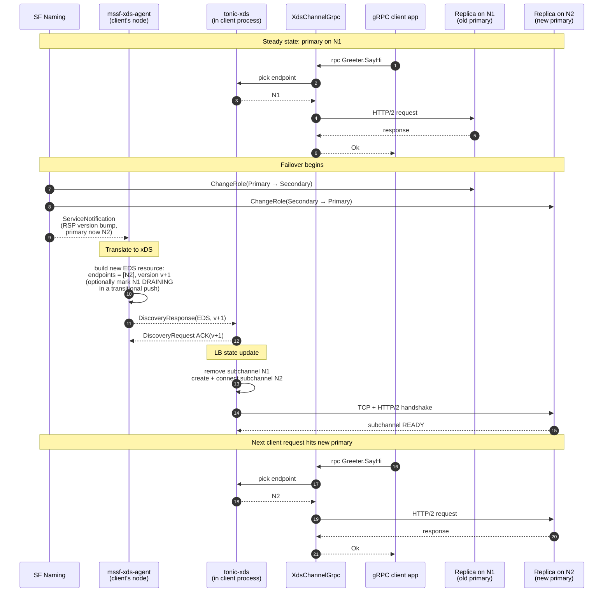

# gRPC xDS over Service Fabric Naming — Proposal

Status: Proposal / experiment. Nothing shipped.

Date: 2026-06-04

Owners: mssf maintainers

## Background

Service Fabric (SF) services are addressed by Fabric URIs
(`fabric:/App/Service`) and resolved at runtime via
[FabricClient naming](../../crates/libs/util/src/resolve.rs).
Stateful services are partitioned, each partition has a primary
and zero or more secondaries, and the primary can move between
nodes (failover, rebalancing, upgrade) at any time.

gRPC clients running on a SF cluster — in any language — need to:

- Discover the current endpoint(s) of a service partition.
- React to primary failover without manual reconnect logic.
- Optionally fan out across replicas for load balancing or
  read-from-secondary patterns.
- Optionally route requests across partitions of a partitioned
  service.

[gRPC xDS](https://github.com/grpc/proposal/blob/master/A27-xds-global-load-balancing.md)
is the standard answer to those needs in the gRPC ecosystem.
gRPC clients in Go/Java/C++/Node have built-in xDS resolvers
that accept `xds:///<authority>` URIs, fetch `Listener` /
`RouteConfiguration` / `Cluster` / `ClusterLoadAssignment`
resources from a control plane, and apply the matching LB
policy. The control plane is whatever speaks the xDS protocol
([Envoy xDS APIs](https://www.envoyproxy.io/docs/envoy/latest/api-docs/xds_protocol)).

This proposal explores a **SF-naming-backed xDS data source** so
any gRPC client on a SF cluster can use the standard xDS
plumbing to talk to SF services.

## Goals

1. Let any gRPC client on a SF cluster reach an SF service via
   `xds:///fabric/<App>/<Service>` (or similar) without any
   SF-specific client code.
2. Translate SF naming (`ResolvedServicePartition`,
   `ServiceEndpointRole`, partition info, notification stream)
   into the xDS resource model
   ([LDS/RDS/CDS/EDS](https://www.envoyproxy.io/docs/envoy/latest/api-docs/xds_protocol#resource-types)).
3. Map SF stateful semantics (primary / secondary / partition
   key) onto standard xDS LB policies — `round_robin` for
   stateless, priority-routing for primary-with-fallback,
   `ring_hash` for sticky-by-key.
4. Stay incremental: ship a minimum viable EDS-only experiment
   first; add RDS/CDS sophistication and ORCA only when a real
   workload needs them.

## Non-Goals

- A full xDS control plane. Implement only the subset gRPC
  clients consume.
- A new server-side runtime. The server side is still a normal
  SF stateful/stateless service that happens to expose gRPC.
- Re-implementing gRPC-xDS in Rust as a client. The
  [`tonic-xds`](https://crates.io/crates/tonic-xds) crate (alpha,
  in [`grpc/grpc-rust`](https://github.com/grpc/grpc-rust/tree/master/tonic-xds))
  is filling that gap upstream; this proposal builds **on** it for
  Rust callers rather than writing a parallel implementation.
- mTLS, RBAC, fault injection, and other xDS features beyond
  service discovery + LB. They compose naturally later but are
  out of scope for v1.

## Architecture options

Three places the SF→xDS translation can live. All three are
open — they can be evaluated independently, and more than one
can ship behind a common SF→xDS core library.

### Option A — In-process xDS source (Rust only)

A Rust library that implements gRPC-xDS-the-client locally:
parses `xds:///fabric/...` URIs, owns a `FabricClient` and
naming plumbing, and feeds endpoints through gRPC's LB policy
machinery.

Pros: no extra process; pure in-process call.

Cons: requires a Rust gRPC xDS client implementation. None
exists in `tonic` today. Building one is a large undertaking
(LB policy registry, subchannel state machines, ORCA, RLS,
…).

### Option B — Local xDS agent (per node)

A small `mssf-xds-agent` process (Rust, built on `tonic`) runs
on every SF node, listens on a loopback port, and speaks
[ADS](https://www.envoyproxy.io/docs/envoy/latest/api-docs/xds_protocol#aggregated-discovery-service)
to local gRPC clients. It owns a `FabricClient`, registers a
[notification filter](https://learn.microsoft.com/en-us/dotnet/api/system.fabric.servicenotificationfilterdescription)
for the SF URIs it serves, and translates pushes into xDS
`DiscoveryResponse`s.

Clients are configured with `XDS_BOOTSTRAP=/etc/sf/xds.json`
pointing at `127.0.0.1:<port>`. Any gRPC language works
unchanged.

```
+----------------+         +-----------------------+
| gRPC client    | xds:/// | mssf-xds-agent (Rust) |
| (Go/Java/Rust) +-------->+  - ADS server (tonic) |
+----------------+         |  - FabricClient       |
                           |  - notif filter       |
                           +-----------+-----------+
                                       | SF FabricClient COM
                                       v
                              +-----------------+
                              | SF Naming       |
                              +-----------------+
```

Pros: works for every language. Sidecar-style deploy fits SF's
node-level model (one agent as a stateless `-1` service or
guest exe).

Cons: extra process to deploy and monitor. Loopback hop on every
new subchannel (one-time, cheap).

### Option C — Centralized control plane

One (or HA-set) `mssf-xds-control-plane` service per cluster.
Clients connect directly to it. Simplest deploy if the cluster
already runs a control-plane-flavored service.

Pros: one place to add policy, RBAC, telemetry.

Cons: extra network hop on every xDS stream; CP becomes a
cluster-wide SPOF if not HA.

## SF naming → xDS resource mapping

xDS has four resource types gRPC consumes:
[Listener](https://www.envoyproxy.io/docs/envoy/latest/api-docs/xds_protocol#listener),
[RouteConfiguration](https://www.envoyproxy.io/docs/envoy/latest/api-docs/xds_protocol#routeconfiguration),
[Cluster](https://www.envoyproxy.io/docs/envoy/latest/api-docs/xds_protocol#cluster),
[ClusterLoadAssignment](https://www.envoyproxy.io/docs/envoy/latest/api-docs/xds_protocol#clusterloadassignment)
(EDS).

### URI scheme

`xds:///fabric/<app>/<service>[?role=primary|secondary|all][&partition=<key>]`

The `fabric/<app>/<service>` portion is the xDS resource name
(LDS / Listener key). Query params are parsed by the agent into
RDS / CDS variants.

Examples:

| URI | Meaning |
|---|---|
| `xds:///fabric/MyApp/Greeter` | partitioned-singleton, default LB |
| `xds:///fabric/MyApp/Greeter?role=primary` | force primary-only cluster |
| `xds:///fabric/MyApp/Kv?partition=user:42` | hash-bucket lookup |

### Mapping table

| SF concept | xDS resource | Notes |
|---|---|---|
| Fabric URI (`fabric:/App/Svc`) | `Listener` name | One listener per URI; created lazily on first subscribe. |
| Partition (`PartitionKeyType::*`) | `RouteConfiguration` → `Cluster` selection | For singleton: one cluster. For Int64/Named: `Route` per partition, matched via request header `mssf-partition-key` or `:authority` suffix. |
| `ServiceEndpointRole::StatefulPrimary` | `Cluster` name `...-primary` + `Priority 0` in EDS | Optionally aggregated with secondaries (Priority 1) for failover routing. |
| `ServiceEndpointRole::StatefulSecondary` | `Cluster` name `...-secondary` + EDS with `round_robin` | For read-from-secondary patterns. |
| `ResolvedServiceEndpoint.address` (URL string) | `LbEndpoint.endpoint.address` | Agent parses the SF endpoint string; fails the resource if unparseable. |
| `ResolvedServicePartition` version bump (notification) | EDS `DiscoveryResponse` push | Standard xDS push semantics; no client polling. |
| `ServicePartitionAccessStatus::NotPrimary` (server side) | `HealthStatus::UNHEALTHY` on the endpoint | Removes endpoint from active set without dropping the connection; gRPC LB will pick another. |
| `ServicePartitionInformation` (Int64/Named ranges) | `LbEndpoint` metadata + `RingHashLbConfig` hash policy on the route | For sticky-by-key. |

### LB policy mapping

| SF pattern | xDS LB policy | Config |
|---|---|---|
| Stateless service, fan out | `ROUND_ROBIN` | default |
| Stateless service, latency-aware | `LEAST_REQUEST` | `choice_count=2` |
| Stateful primary only | `ROUND_ROBIN` over a 1-endpoint EDS | primary cluster only |
| Stateful primary with read-from-secondary | priority-aggregated cluster: P0 = primary, P1 = secondaries | `PriorityLoadAssignment` + per-call route choice |
| Sticky-by-key (Int64/Named partitioning) | `RING_HASH` | `hash_policy` from `mssf-partition-key` header or path-template; ring nodes = partition primaries |

## Failover signal

The control plane sees primary-role-change events globally, so a
client-side per-response signal is not needed under xDS. Two
mechanisms, used together:

### Push-driven (preferred)

The agent registers a notification filter for the URI. When SF
naming says "primary moved from N1 to N2," the agent emits a
fresh EDS `DiscoveryResponse` with updated endpoint addresses
(or with the old primary marked `HealthStatus::DRAINING`).
gRPC's LB picks the new primary on the next request.

### Server-side ORCA reports (optional, for richer signals)

A server that's lost its primary role can emit an
[ORCA](https://github.com/cncf/xds/blob/main/xds/data/orca/v3/orca_load_report.proto)
load report with a custom utility metric (e.g.
`mssf.role.degraded = 1`). gRPC's `weighted_round_robin` /
`xds_wrr` LB honors per-endpoint utility. The agent doesn't
need to know about the event; the data plane self-adjusts.

ORCA is additive; the push-driven path is the primary mechanism.

## Failover walkthrough — primary moves N1 → N2

End-to-end sequence for a stateful service whose primary moves
from node N1 to node N2, with one gRPC client on a third node
holding an open `XdsChannelGrpc`.

Starting state:

- SF naming returns one primary endpoint on N1.
- The local `mssf-xds-agent` on the client's node has an active
  ADS stream open to `tonic-xds`, serving an EDS resource
  `fabric/MyApp/Greeter-primary` with one `LbEndpoint{N1:port}`.
- `tonic-xds` has subchannel state `READY` for N1 and is routing
  all requests there.



### Concurrent in-flight requests

A request dispatched on the old N1 subchannel before step 12
completes against N1 according to whatever N1 decides as a
secondary. Three sub-cases:

1. **N1 can serve it as secondary** (e.g. a read) — returns
   `Ok`, the client sees no failover at all.
2. **N1 cannot serve it** — returns `Code::Unavailable` (or
   similar). The xDS LB has already redirected new picks to N2,
   so the application's outer retry succeeds on the next attempt.
3. **N1's listener died before responding** — hyper / `tonic-xds`
   sees the connection error, evicts the subchannel; the
   already-pushed EDS update means the next pick is N2.

### Failure-mode variants

| Variant | What changes in the diagram |
|---|---|
| **N1 process crashes (no graceful role-change)** | Steps 7–8 don't happen first; instead the open HTTP/2 connection fails. `tonic-xds` evicts the N1 subchannel on TCP error. The agent still gets a notification within seconds and pushes EDS v+1. Order is reversed but the destination is the same. |
| **N2 not yet ready when push arrives** | Step 14 fails until N2 accepts connections. `tonic-xds` keeps the subchannel in `CONNECTING` and surfaces `Unavailable` to picks until ready. Client retries succeed once N2 transitions. |
| **Notification delivery delayed** | Steady-state lag (sub-second on a healthy cluster). Requests in the gap may hit N1 and bounce with `Code::Unavailable` until the push lands. Caller-side retry policy covers the window. |
| **Old primary marked `DRAINING` first, removed in a second push** | Two `DiscoveryResponse`s instead of one. `tonic-xds` stops picking N1 for new RPCs immediately at the `DRAINING` push; in-flight requests finish; the second push (endpoint removed) closes the idle subchannel. Useful for graceful shedding when SF gives advance notice. |
| **Multiple concurrent failovers (e.g. primary plus a secondary)** | Each is one notification → one EDS push, versioned and ACKed independently via ADS. The dataplane converges on the last-pushed state. |

### Why this is "automatic" from the client's perspective

The client app code in this proposal is exactly the
`XdsChannelBuilder` snippet above — no reconnect logic, no
retry-on-trailer plumbing, no SF-specific imports. The two
behavioural changes the client *might* observe during a
failover are:

1. A burst of `Code::Unavailable` errors over the brief
   notification + reconnect window. Handled by any standard
   gRPC retry policy (`tonic`'s built-in retry layer or a
   `tower::retry` middleware) with the caller's own
   idempotency rules.
2. A first-request latency hit on the new subchannel for the
   TCP + HTTP/2 handshake to N2 (single-digit ms on a healthy
   intra-cluster network).

## Forced re-resolve on client-observed failure

The previous section assumes the EDS push arrives in time. What
if a write fails *before* the agent learns about the role
change? Can the client tell the agent "my data looks stale,
please re-resolve"?

### xDS has no client-initiated invalidation message

The xDS protocol is push-only from the control plane. The
client → server messages on an ADS stream are:

| Message | What it does | Forces re-resolve? |
|---|---|---|
| `DiscoveryRequest` (initial) | Subscribe to resource names | No — only opens the stream |
| `DiscoveryRequest` (ACK) | Acknowledge a version | No |
| `DiscoveryRequest` (NACK) | Reject a version with `error_detail` | No — server doesn't retry |
| LRS load report | Stream load stats back to CP | Informational |
| ORCA report | Per-endpoint utility | Informational |

There is deliberately no "reload this resource" RPC. The model
is "CP is the source of truth, data plane converges." Adding
client-initiated invalidation would break the eventual-consistency
semantics that make ADS scalable.

### Does `resolveNow()` help?

`resolveNow()` is gRPC's internal LB-policy → resolver callback
that fires when "all my subchannels are dead, please re-resolve."
Useful intuition, but:

- **For the DNS resolver** it triggers an immediate `getaddrinfo`.
- **For the xDS resolver** it is essentially a no-op. The xDS
  resolver doesn't re-query an upstream — the ADS stream is
  already open, the most recent cached resources are still
  current, and the server hasn't pushed anything new. **No
  wire traffic leaves the client**, so the agent never sees
  the signal.

That makes `resolveNow()` insufficient as the primary failover
mechanism on its own. It does still help indirectly: after it
fires, the LB policy will retry connection attempts against the
current endpoint set, which is the right thing to do during a
transient blip.

### Three workable paths if push isn't fast enough

If Phase 2 notification latency turns out to be insufficient for
some workload's failure budget, three options — none requires
breaking the xDS spec:

1. **LRS-driven re-resolve at the agent.** Enable LRS reporting
   on the client. The agent watches reported failure rates per
   endpoint; when a cluster's failure rate spikes, the agent
   proactively re-resolves the corresponding SF URI with
   `previousResult` and pushes a fresh EDS. Stays purely within
   standard xDS (LRS is part of the spec). Cost: tuning the
   threshold to avoid false-positive re-resolves on real
   transient errors.
2. **ORCA-driven re-resolve at the agent.** Same idea, but the
   server emits a custom ORCA utility metric (e.g.
   `mssf.role.degraded = 1`) when it detects it's no longer the
   right replica. The agent treats that as a strong hint and
   re-resolves. More accurate than LRS (server knows its own
   role authoritatively) but requires server-side cooperation.
3. **SF-specific side-channel "complain" RPC on the agent.**
   The agent exposes a small non-xDS RPC like
   `Complain(uri: string) -> Ack` on its loopback port. Client
   code that knows it just hit a stale-primary error calls it;
   the agent re-resolves SF immediately and pushes EDS. This
   *does* require SF-specific client glue (defeats the "vanilla
   xDS client" goal for callers that opt in), so it is an
   opt-in fast-path, not the default.

The agent's perspective is the same in all three: convert a
"this endpoint looks wrong" signal into a SF naming resolve with
`previousResult`, then push EDS. The complaint protocol is SF's
existing mechanism for "tell me something newer than what I have"
— see the existing
[`ServicePartitionResolver`](../../crates/libs/util/src/resolve.rs)
docstring.

### Recommendation

- **Phase 1–2:** rely on push-only. Measure notification
  end-to-end latency on a real cluster. If sub-second on the
  failover events that matter, stop.
- **Phase 5+:** if a workload needs sub-100ms failover detection
  *and* the notification path can't deliver it, add LRS-driven
  re-resolve at the agent (path 1) since it doesn't require
  client or server changes.
- **Side-channel complain RPC** is the escape hatch when even
  LRS aggregation is too slow. Keep it opt-in; the steady-state
  client code should remain a vanilla `XdsChannelBuilder`.

## Rust client story

The upstream [`tonic-xds`](https://crates.io/crates/tonic-xds)
crate (currently `0.1.0-alpha.1`, source in
[`grpc/grpc-rust/tonic-xds`](https://github.com/grpc/grpc-rust/tree/master/tonic-xds))
is the long-term answer for Rust callers. Its public API today is
essentially:

```rust
use tonic_xds::{XdsChannelBuilder, XdsChannelConfig, XdsUri};

let target = XdsUri::parse("xds:///fabric/MyApp/Greeter")?;
let channel = XdsChannelBuilder::with_config(
    XdsChannelConfig::default().with_target_uri(target),
).build_grpc_channel();
let client = GreeterClient::new(channel);
```

`XdsChannelGrpc` is a `tonic::client::GrpcService` implementing
the standard ADS-subscribe + LDS/RDS/CDS/EDS + P2C LB stack, and
`XdsChannel` exposes the same plumbing as a generic
`tower::Service` for non-gRPC HTTP. Aimed at the same
[gRPC xDS features](https://github.com/grpc/grpc/blob/master/doc/grpc_xds_features.md)
list that Go/Java/C++ implement.

For this proposal that means Rust callers behave like every
other language: configure `XDS_BOOTSTRAP` to point at the local
`mssf-xds-agent`, parse `xds:///fabric/...`, done. No SF-specific
resolver code in the client.

Three near-term caveats:

1. `tonic-xds` is **alpha** (one published version, ~20 total
   downloads at time of writing). Feature coverage and API
   stability will move. Plan to pin a version and track upstream.
2. The agent → `tonic-xds` interop is just "standard xDS," but
   it's worth an explicit conformance test against the
   `tonic-xds` examples early in Phase 1 to catch any
   alpha-era quirks.
3. If `tonic-xds` doesn't yet implement a feature a workload
   needs (e.g. ring-hash, ORCA, LRS reporting), Rust callers can
   fall back to a thin shim that opens an ADS stream to the
   local agent, reads only EDS, and feeds endpoints into
   [`Channel::balance_channel`](https://docs.rs/tonic/0.14/tonic/transport/struct.Channel.html#method.balance_channel)
   — strictly a stopgap, not a long-term path.

## Phased experiment plan

### Phase 0 — Decide if xDS is worth pursuing

- Pick one real polyglot workload (e.g. a Java/Go gRPC client
  that wants to call a Rust SF stateful service). If none,
  defer this whole proposal.
- Validate that the gRPC-xDS clients in those languages
  actually accept a minimal ADS source (some early versions
  require LRS, ALS, etc.).

### Phase 1 — Minimal `mssf-xds-agent`, EDS only

- Crate: `crates/tools/mssf-xds-agent` (a new binary).
- Speaks ADS, serves only `Listener` (stub) + `Cluster` (one
  per URI, fixed `ROUND_ROBIN`) + `EDS` (from SF naming).
- One `FabricClient` shared across all URIs.
- Selector logic (which endpoints to include, role filter) is
  parameterized per URI via the URI query string.
- No notification filter yet — refresh-on-subscribe + periodic
  re-poll. Establishes the wire shape with the smallest possible
  surface.

### Phase 2 — Notification-driven push

- Register `ServiceNotificationFilterDescription` per active
  URI subscription.
- Convert notifications to xDS pushes (versioned, ACK/NACK
  loop).
- The agent's lifetime is the process lifetime, which sidesteps
  the filter-lifecycle-on-Drop and FabricClient cleanup race
  that complicate in-process notification consumers.

### Phase 3 — Partitioned services + sticky LB

- Add `RING_HASH` cluster shape for Int64/Named partitioned
  services.
- Route requests by `mssf-partition-key` header (or a
  configurable hash policy).
- Validate against `KvStore` sample (Int64 partitioning).

### Phase 4 — Priority routing (primary + secondaries)

- Aggregate primary + secondaries into one cluster with
  priorities. Default route → P0 (primary). Read-only route
  (header gated) → P0/P1.
- Maps directly to "read-from-secondary" without server-side
  changes.

### Phase 5 — Optional ORCA + LRS

- If a workload actually needs load-aware LB, wire ORCA
  reports out of the SF service (custom metric for role
  status). LRS reporting back to the agent is gRPC-built-in.

Stop at the earliest phase that satisfies real demand.

## Deployment

`mssf-xds-agent` runs on every node. Two reasonable shapes:

1. **SF guest-exe stateless `-1` service.** Standard SF
   primitive; managed by SF itself; easy to upgrade.
2. **systemd / Windows service installed by the cluster
   bootstrap.** Lives outside SF's app model; useful if the
   agent must come up before any user service.

Either way, the agent listens on `127.0.0.1:<fixed-port>` and
the cluster bootstrap drops an `xds_bootstrap.json` in a
well-known path. Clients export `GRPC_XDS_BOOTSTRAP=<path>`.

## Security

- Loopback-only by default. Cross-node xDS traffic is **not** a
  goal; every node has its own agent.
- The agent runs as a service account with FabricClient
  credentials. Standard SF security boundaries apply.
- xDS-level mTLS / RBAC is deferred (Future work). Until then,
  xDS data is host-trust scoped.

## Open questions

- **Resource naming convention.** Is `xds:///fabric/<App>/<Svc>`
  the right URI shape, or do we want `xds:///<cluster>/<App>/<Svc>`
  to allow multi-cluster routing later? Locking in the URI shape
  is the highest-cost decision in Phase 1.
- **Authority handling.** xDS bootstrap supports multiple
  authorities (each can point at a different control plane).
  Useful for federation; complicates the agent. Defer.
- **Notification filter granularity.** Per-URI filters or one
  catch-all filter per app? Per-URI is simpler; catch-all may
  be more efficient for apps with hundreds of services.
- **Service config vs. xDS-driven config.** gRPC also accepts a
  static service config blob (LB policy + retry). Should the
  agent always push service config via LDS, or rely on
  client-side defaults? LDS push is more uniform; client-side
  is simpler.
- **`tonic-xds` version pinning.** Alpha crate, single published
  version. What's the policy when it churns — pin and re-test
  per release, or wait for a stable line?

## Future work

- **mTLS / SDS** via xDS Secret Discovery Service.
- **Fault injection / circuit breakers** from
  `Cluster.outlier_detection` (free once xDS is in place).
- **gRPC RLS** (Route Lookup Service) for very-dynamic routing
  if a workload needs it.
- **Upstream contributions to `tonic-xds`.** Anything we have
  to build around it (e.g. extra LB-policy hooks, ORCA emit
  helpers) is probably worth upstreaming rather than carrying
  as a SF-only fork.
- **Multi-cluster federation** across SF clusters via xDS
  authorities.

## References

- [gRFC A27: xDS-based Global Load Balancing](https://github.com/grpc/proposal/blob/master/A27-xds-global-load-balancing.md)
- [gRFC A28: xDS Traffic Splitting and Routing](https://github.com/grpc/proposal/blob/master/A28-xds-traffic-splitting-and-routing.md)
- [gRFC A42: xDS Ring Hash LB Policy](https://github.com/grpc/proposal/blob/master/A42-xds-ring-hash-lb-policy.md)
- [gRFC A51: Custom LB Policies](https://github.com/grpc/proposal/blob/master/A51-custom-lb-policies.md)
- [xDS protocol reference](https://www.envoyproxy.io/docs/envoy/latest/api-docs/xds_protocol) — canonical xDS protocol spec.
- [ORCA load report proto](https://github.com/cncf/xds/blob/main/xds/data/orca/v3/orca_load_report.proto)
- [`tonic-xds` on crates.io](https://crates.io/crates/tonic-xds) — upstream Rust xDS client used by SF Rust callers.
- [`grpc/grpc-rust/tonic-xds`](https://github.com/grpc/grpc-rust/tree/master/tonic-xds) — `tonic-xds` source and issue tracker.
- [gRPC xDS features matrix](https://github.com/grpc/grpc/blob/master/doc/grpc_xds_features.md) — reference list of xDS features gRPC implementations align to.
- [`crates/libs/util/src/resolve.rs`](../../crates/libs/util/src/resolve.rs) — `ServicePartitionResolver`, the SF-side naming primitive the agent builds on.
