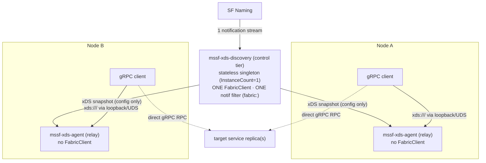
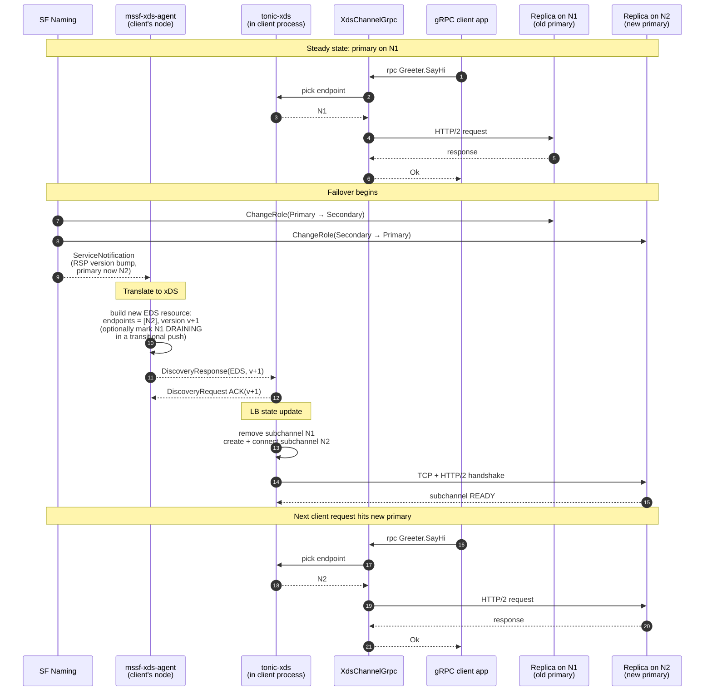

# gRPC xDS over Service Fabric Naming — Proposal

Status: Proposal / experiment. Nothing shipped.

Date: 2026-06-04 (last updated 2026-07-16)

Owners: mssf maintainers

## Why pursue this?

**The value is client simplicity.** With `tonic-xds`, reaching an
SF service is a vanilla xDS channel:

```rust
let channel = XdsChannelBuilder::with_config(
    XdsChannelConfig::default()
        .with_target_uri(XdsUri::parse("xds:///fabric/MyApp/Greeter")?),
).build_grpc_channel();
let client = GreeterClient::new(channel);
```

No SF-specific client code, no notification registration, no
endpoint parsing, no LB wiring — and the *same* code shape in
every gRPC language (Go/Java/C++/Node/Rust).

Contrast the direct path a Rust caller uses today: construct a
`FabricClient`, register a notification filter, build a
[`ServicePartitionResolver`](../../crates/libs/util/src/resolve.rs)
with a retryer, write a `TargetSelector` to pick a replica and
parse its address, and feed the result into
[`Channel::balance_channel`](https://docs.rs/tonic/0.14/tonic/transport/struct.Channel.html#method.balance_channel).
That works, but it's a lot of SF-aware boilerplate — and it only
exists in Rust. xDS moves that complexity into the agent, once,
behind a standard interface.

The tradeoff: an `mssf-xds-agent` must run on each node. So this
is worth it when either (a) non-Rust gRPC clients need SF services
(they have no `ServicePartitionResolver` equivalent), or (b) even
Rust callers want the simpler, uniform xDS client instead of the
manual plumbing. If neither holds — a single Rust caller happy
with the direct path and no desire to run an agent — the direct
path is fine and this proposal is optional.

Phase 0 still validates the chosen client(s) against a minimal ADS
source before building anything.

## Background

Service Fabric (SF) services are addressed by Fabric URIs
(`fabric:/App/Service`) and resolved at runtime via
[FabricClient naming](../../crates/libs/util/src/resolve.rs).
Stateful services are partitioned, each partition has a primary
and zero or more secondaries, and the primary can move between
nodes (failover, rebalancing, upgrade) at any time.

gRPC clients running on a SF cluster — in any language — need to:

- Discover the current endpoint(s) of a service partition.
- React to primary failover without manual reconnect logic.
- Optionally fan out across replicas for load balancing or
  read-from-secondary patterns.
- Optionally route requests across partitions of a partitioned
  service.

[gRPC xDS](https://github.com/grpc/proposal/blob/master/A27-xds-global-load-balancing.md)
is the standard answer to those needs in the gRPC ecosystem.
gRPC clients in Go/Java/C++/Node have built-in xDS resolvers
that accept `xds:///<authority>` URIs, fetch `Listener` /
`RouteConfiguration` / `Cluster` / `ClusterLoadAssignment`
resources from a control plane, and apply the matching LB
policy. The control plane is whatever speaks the xDS protocol
([Envoy xDS APIs](https://www.envoyproxy.io/docs/envoy/latest/api-docs/xds_protocol)).

This proposal explores a **SF-naming-backed xDS data source** so
any gRPC client on a SF cluster can use the standard xDS
plumbing to talk to SF services.

## Goals

1. Let any gRPC client on a SF cluster reach an SF service via
   `xds:///fabric/<App>/<Service>` (or similar) without any
   SF-specific client code.
2. Translate SF naming (`ResolvedServicePartition`,
   `ServiceEndpointRole`, partition info, notification stream)
   into the xDS resource model
   ([LDS/RDS/CDS/EDS](https://www.envoyproxy.io/docs/envoy/latest/api-docs/xds_protocol#resource-types)).
3. Map SF stateful semantics (primary / secondary / partition
   key) onto standard xDS resources — `round_robin` for
   stateless, priority-routing for primary-with-fallback, and
   RDS `Route` matching on the partition key to select the owning
   partition (which then reuses the same primary LB).
4. Stay incremental: ship a minimum viable EDS-only experiment
   first; add RDS/CDS sophistication and ORCA only when a real
   workload needs them.

## Non-Goals

- A full xDS control plane. Implement only the subset gRPC
  clients consume.
- A new server-side runtime. The server side is still a normal
  SF stateful/stateless service that happens to expose gRPC.
- Re-implementing gRPC-xDS in Rust as a client. The
  [`tonic-xds`](https://crates.io/crates/tonic-xds) crate (alpha,
  in [`grpc/grpc-rust`](https://github.com/grpc/grpc-rust/tree/master/tonic-xds))
  is filling that gap upstream; this proposal builds **on** it for
  Rust callers rather than writing a parallel implementation.
- mTLS, RBAC, fault injection, and other xDS features beyond
  service discovery + LB. They compose naturally later but are
  out of scope for v1.

## Architecture

The SF→xDS translation runs in an out-of-process **local xDS
agent** (below), deployed per node. It has a single-tier and a
two-tier form (see [Two-tier discovery](#two-tier-discovery-sf-yarp-inspired)),
and the same agent code can be co-hosted with a client in one
process for tests (see
[Single-process test harness](#single-process-test-harness)).

> **Rejected as the basis — in-process Rust-only source.** An
> in-process Rust path already exists
> ([`FabricTargetResolver`](../../crates/libs/util/src/tonic/naming/mod.rs)
> + [`Channel::balance_channel`](https://docs.rs/tonic/0.14/tonic/transport/struct.Channel.html#method.balance_channel),
> no xDS) and stays the recommended baseline for a lone Rust caller
> (see [Why pursue this?](#why-pursue-this)). It is not the basis
> for *this* proposal because it only helps Rust and gives up the
> uniform, language-agnostic xDS interface — not because it is
> technically hard. Hand-writing a full xDS *client* in Rust would
> be hard, but that is unnecessary: `tonic-xds` already provides
> one, and it can even run in-process against an in-process ADS
> source, as the [test harness](#single-process-test-harness) does.

### Local xDS agent (per node)

A small `mssf-xds-agent` process (Rust, built on `tonic`) runs
on every SF node (as an SF stateless `-1` service, see
[Deployment](#deployment)), listens on a local endpoint (loopback
TCP or a Unix domain socket), and speaks
[ADS](https://www.envoyproxy.io/docs/envoy/latest/api-docs/xds_protocol#aggregated-discovery-service)
to local gRPC clients. Clients are configured with
`GRPC_XDS_BOOTSTRAP` pointing at the local agent (loopback
`127.0.0.1:<port>` or a `unix:` socket), so any gRPC language works
unchanged.

```
+----------------+         +-----------------------+
| gRPC client    | xds:/// | mssf-xds-agent (Rust) |
| (Go/Java/Rust) +-------->+  - ADS server (tonic) |
+----------------+         |  - FabricClient       |
                           |  - notif filter       |
                           +-----------+-----------+
                                       | SF FabricClient COM
                                       v
                              +-----------------+
                              | SF Naming       |
                              +-----------------+
```

Where the SF-facing discovery lives has two shapes, both valid for
the local agent:

- **Single-tier (simplest).** Each agent owns its own
  `FabricClient`, registers a
  [notification filter](https://learn.microsoft.com/en-us/dotnet/api/system.fabric.servicenotificationfilterdescription)
  for the SF URIs it serves, and translates naming pushes into xDS
  `DiscoveryResponse`s locally (the diagram above). Good for small
  clusters and the earliest experiment.
- **Two-tier (scalable, SF-YARP-style).** Borrowed from
  [microsoft/service-fabric-yarp](https://github.com/microsoft/service-fabric-yarp):
  a **single** `mssf-xds-discovery` control tier owns the one
  `FabricClient` and registers **one** cluster-wide notification
  filter, does the SF→xDS translation once, and publishes the
  snapshot; each per-node agent drops its `FabricClient` and becomes
  a thin relay that re-serves the snapshot locally. This collapses
  N per-node naming subscriptions to one. See
  [Two-tier discovery](#two-tier-discovery-sf-yarp-inspired) for the
  full design.

Start single-tier to nail the wire shape, then split into the
two-tier form when per-node naming load or config consistency
warrants it — the SF→xDS translation code is identical in both;
only *where it runs* changes.

Pros: works for every language; deploys as a stateless `-1` service
that fits SF's node-level model. In the two-tier form, one
notification registration and one authoritative translation serve
the whole cluster. Client RPCs always go direct to the target
replica (no data-path hop).

Cons: extra process(es) to deploy and monitor; a one-time local hop
on every new subchannel (cheap). The two-tier form adds a singleton
control tier — on its restart, relays serve last-known-good, so it
is a config-freshness gap rather than a data-path outage — plus an
extra hop on the *config* path (not the request path).

### Single-process test harness

For tests and local development, the agent's code can run **in the
same OS process** as the gRPC client — no SF cluster, no separate
binary, no `GRPC_XDS_BOOTSTRAP` file wiring. A test starts the ADS
server on an ephemeral loopback port (or an in-memory
`tokio::io::duplex` transport), points a `tonic-xds` channel at it,
and drives requests end-to-end inside one `#[tokio::test]`. The SF
naming source is swapped for a fake that yields scripted
`ResolvedServicePartition`s, so failover, empty-endpoint, and
partition-selection cases are exercised deterministically without a
real `FabricClient`.

This is purely a **test harness**, not a deployment shape: it keeps
the SF→xDS translation and the ADS wire format under
unit/integration test while the production path stays the
out-of-process per-node agent above. It is the natural home for the
conformance check against `tonic-xds` (caveat 3 in
[Rust client story](#rust-client-story)) and for regression tests of
the [failover walkthrough](#failover-walkthrough--primary-moves-n1--n2).
Build it as a reusable fixture (e.g. `mssf-xds-agent`'s test support
module) so every later phase reuses it.

## Two-tier discovery (SF-YARP-inspired)

[microsoft/service-fabric-yarp](https://github.com/microsoft/service-fabric-yarp)
solves the same shape of problem for HTTP and is worth copying: it
**separates discovery from the data plane**. Rather than have every
proxy node talk to `FabricClient`, SF-YARP splits into two services:

- `FabricDiscovery.Service` — a **stateless singleton**
  (`FabricDiscovery_InstanceCount = 1`) that owns the one
  `FabricClient`, registers **one** cluster-wide
  `ServiceNotificationFilterDescription` (name `fabric:`,
  `matchNamePrefix: true`), discovers the topology, and exposes a
  **summarized** config for consumers to pull in real time. It is
  *not* replicated/HA — on failure SF restarts the single instance
  and consumers serve last-known-good during the gap.
- `YarpProxy.Service` — the data plane, deployed on **every** node
  (stateless `-1`). It holds **no** `FabricClient` and registers
  **no** notification filter; it just consumes the summarized config
  from the discovery service and proxies traffic.

One relevant divergence: SF-YARP **does not handle partition keys**
(it enumerates partitions but requires the caller to pass a
partition GUID as a query parameter). This proposal goes beyond it
with `mssf-partition-key` + RDS `Range`/`Exact` matching (see
[LB policy mapping](#lb-policy-mapping)); only the *discovery
split* is borrowed, not SF-YARP's partition limitation.

The payoff SF-YARP gets — and the reason to borrow it — is that the
expensive, chatty SF-naming subscription happens **once** for the
whole cluster instead of once per node.

### Applying the split to xDS

Map the two SF-YARP tiers onto the agent:

| SF-YARP | xDS analog | Runs where | Owns `FabricClient`? | Notification filter? |
|---|---|---|---|---|
| `FabricDiscovery.Service` | `mssf-xds-discovery` (control tier) | stateless singleton (`InstanceCount=1`) | **Yes**, exactly one | **One** cluster-wide `fabric:` prefix filter |
| `YarpProxy.Service` | `mssf-xds-agent` (relay tier) | every node, stateless `-1` | No | No |
| summarized config API | ADS snapshot stream (discovery → relay) | — | — | — |

The relay is, in xDS terms, a **caching proxy**: an xDS *client*
upstream to the control tier and an xDS *server* downstream to its
local clients. Two ways it can re-serve the snapshot, an open
design choice:

- **Verbatim** — hold the whole cluster's LDS/RDS/CDS/EDS and serve
  it to any local client. Simplest, but every node caches the full
  snapshot (memory + fan-out grow with cluster size, partly working
  against the scaling win).
- **On-demand (filtered)** — forward each local client's resource
  subscriptions upstream and cache only what its clients asked for.
  Scales better but is real xDS-federation work (subscription
  propagation, per-relay resource sets). LDS/CDS are named
  subscriptions, so the relay already knows *what* is wanted; the
  cost is plumbing it upstream.

Start verbatim (simple, correct); move to on-demand only if
per-node snapshot size becomes a problem.

The control tier does the SF→xDS translation described in
[SF naming → xDS resource mapping](#sf-naming--xds-resource-mapping)
**once** and publishes the resulting LDS/RDS/CDS/EDS snapshot. Each
per-node relay subscribes to that snapshot and re-serves it verbatim
(or filtered to just the URIs its local clients actually asked for)
over the local loopback/UDS ADS endpoint. Node-local gRPC clients
are unchanged — they still point at `127.0.0.1` / a UDS via
`GRPC_XDS_BOOTSTRAP` and speak vanilla xDS.

Crucially, only the **config** takes the extra hop (control tier →
relay). Client RPCs still connect **directly** to the target
replica's endpoint, exactly as in the single-tier form — the
two-tier split adds no data-path latency.



### Why borrow it — per-node notification cost

In the single-tier form of the
[local agent](#local-xds-agent-per-node), each of *N* nodes
runs an agent that independently registers a `fabric:`
catch-all `ServiceNotificationFilterDescription`. That is **N**
cluster-wide subscriptions against SF Naming, **N** copies of the
same topology stream, and **N** redundant SF→xDS translations — all
producing identical output. On a large cluster that is real,
avoidable load on the naming subsystem. The two-tier split collapses
it to **one** subscription, one translation, and a cheap fan-out of
the already-computed snapshot. This is precisely the trade SF-YARP
makes.

### Freshness: PUSH + PULL, like SF-YARP

Copy SF-YARP's hybrid refresh into the control tier, not just raw
notifications:

- **PULL** — periodically re-poll the full topology (SF-YARP's
  `FullRefreshPollPeriodInSeconds`, default 300s) to self-heal from
  any missed notification.
- **PUSH** — react to endpoint-change notifications to mark services
  dirty and recompute only the affected resources fast.
- **Fail-fast health** — mirror `AbortAfterTimeoutInSeconds`
  (default 600s) / `AbortAfterConsecutiveFailures` (default 3): if
  topology discovery stalls or repeatedly fails, terminate the
  instance so SF restarts it (on this or another node) rather than
  serving stale config. Because the tier is a singleton, relays
  serving last-known-good cover the restart gap.

The [hold-last-known-good / staleness-timeout](#offline--empty-endpoint-window)
policy already proposed for the agent moves into the control tier
unchanged; the relays simply mirror whatever snapshot they last
received.

### Tradeoffs and when to choose it

| | Single-tier (per-node agent) | Two-tier (central discovery) |
|---|---|---|
| Notification registrations | one per node (N) | one per cluster |
| SF→xDS translations | N (redundant) | 1 (authoritative) |
| Config consistency across nodes | eventual, per-node | single source of truth |
| Failure domain | isolated per node | shared singleton control tier; on restart, relays serve last-known-good (config-freshness gap, not a data-path outage) |
| Deploy complexity | one service | two services + a config channel |
| Data-path latency | direct to replica | direct to replica (unchanged) |

Choose the two-tier split when the cluster is large enough that
per-node naming subscriptions or divergent per-node config become a
concern, or when a single authoritative translation (for policy,
telemetry, RBAC later) is valuable. For a small cluster or an early
experiment, the single-tier agent is simpler — so keep the
phasing below.

### Where SF-facing responsibilities live

Several sections below ([Failover signal](#failover-signal),
[Forced re-resolve](#forced-re-resolve-on-client-observed-failure))
are written for the **single-tier** agent, which owns a
`FabricClient` and re-resolves SF directly. Under two-tier those
responsibilities move to the **control tier**, because the relay
has no `FabricClient`:

- Notification handling and SF→xDS translation happen only in the
  control tier; relays just mirror the pushed snapshot.
- The client-observed-failure fast-paths (LRS-driven and
  ORCA-driven re-resolve, and the opt-in `Complain` RPC) cannot
  re-resolve at the relay. The relay **forwards** the signal
  upstream to the control tier, which re-resolves SF and pushes a
  fresh snapshot back down. This adds one control-plane hop to
  those paths — acceptable because they are already the
  slow-path escape hatch, not the steady state.
- Client RPCs are unaffected in both tiers (always direct to the
  replica).

### Phasing

This is a topology refinement layered on the existing
[phased plan](#phased-experiment-plan), not a rewrite:

- **Phases 1–2** stay single-tier (each agent owns a
  `FabricClient`) to nail the wire shape and notification handling
  with the smallest surface.
- **Phase 2.5 (new)** — factor the SF-facing discovery + SF→xDS
  translation into `mssf-xds-discovery` (stateless singleton,
  `InstanceCount=1`) and reduce `mssf-xds-agent` to a snapshot
  relay. The translation code is unchanged; only *where it runs*
  and *how the snapshot reaches the node* change.
- **Phases 3–5** (partitioning, priority routing, ORCA/LRS) then
  implement **once** in the control tier and fan out to every relay
  for free.

## SF naming → xDS resource mapping

xDS has four resource types gRPC consumes:
[Listener](https://www.envoyproxy.io/docs/envoy/latest/api-docs/xds_protocol#listener),
[RouteConfiguration](https://www.envoyproxy.io/docs/envoy/latest/api-docs/xds_protocol#routeconfiguration),
[Cluster](https://www.envoyproxy.io/docs/envoy/latest/api-docs/xds_protocol#cluster),
[ClusterLoadAssignment](https://www.envoyproxy.io/docs/envoy/latest/api-docs/xds_protocol#clusterloadassignment)
(EDS).

### URI scheme and routing strategy

> **The whole strategy in one place.** Service identity and
> per-channel policy live in the **URI**; anything that varies per
> request lives in a **header**.
>
> | Concern | Where | Mechanism |
> |---|---|---|
> | Which service | URI path | `xds:///fabric/<app>/<service>` becomes the xDS resource (Listener) name |
> | Per-channel policy (primary-only vs. read-from-secondary, listener pick) | URI resource-name convention | a distinct resource name the agent maps to a cluster — **not** a query param |
> | Which partition (per request) | `mssf-partition-key` header | RDS route match: `Range` for Int64, `String::Exact` for Named |
>
> The URI is bound once when the channel is built and survives
> failover; a partition key changes per call, so it cannot ride in
> the URI.

`tonic-xds`'s
[`XdsUri`](https://docs.rs/tonic-xds/latest/tonic_xds/struct.XdsUri.html)
keeps only a `target: String` and validates just the `xds`
scheme, so **query params are dropped** — `?role=` / `?partition=`
cannot carry routing intent. Encode per-channel selectors in the
resource name; do per-request partition selection with the header
(see [LB policy mapping](#lb-policy-mapping)).

Examples:

| URI | Meaning |
|---|---|
| `xds:///fabric/MyApp/Greeter` | resolve the service; default LB. Partition (if any) selected per-request via the `mssf-partition-key` header. |
| `xds:///fabric/MyApp/Kv` | partitioned `KvStore`; the client sets `mssf-partition-key: user:42` per call and RDS routes it to the owning partition's cluster. |

### Mapping table

| SF concept | xDS resource | Notes |
|---|---|---|
| Fabric URI (`fabric:/App/Svc`) | `Listener` name | One listener per URI; created lazily on first subscribe. |
| Partition (`PartitionKeyType::*`) | `RouteConfiguration` → `Cluster` selection | Singleton: one cluster. Int64/Named: one `Route` per partition, matched on the `mssf-partition-key` request header. |
| `ServiceEndpointRole::StatefulPrimary` | `Cluster` name `...-primary` + `Priority 0` in EDS | Optionally aggregated with secondaries (Priority 1) for failover routing. |
| `ServiceEndpointRole::StatefulSecondary` | `Cluster` name `...-secondary` + EDS with `round_robin` | For read-from-secondary patterns. |
| `ResolvedServiceEndpoint.address` (URL string) | `LbEndpoint.endpoint.address` | Agent parses the SF endpoint string; see [Endpoint address parsing](#endpoint-address-parsing). Fails the resource if unparseable. |
| `ResolvedServicePartition` version bump (notification) | EDS `DiscoveryResponse` push | Standard xDS push semantics; no client polling. |
| `ServicePartitionAccessStatus::NotPrimary` (server side) | `HealthStatus::UNHEALTHY` on the endpoint | Removes endpoint from active set without dropping the connection; gRPC LB will pick another. |
| Resolve returns **no endpoints** (`FABRIC_E_SERVICE_OFFLINE`) | see [Offline / empty-endpoint window](#offline--empty-endpoint-window) | Service restarting or removed; the resolver in `resolve.rs` retries this case. |
| `ServicePartitionInformation` (Int64/Named ranges) | `Route` match on `mssf-partition-key` → per-partition `Cluster` | Partition **selection** only. Within the chosen cluster, routing is identical to the singleton stateful-primary case. |

### Offline / empty-endpoint window

[`ServicePartitionResolver::resolve`](../../crates/libs/util/src/resolve.rs)
treats an empty endpoint set as `FABRIC_E_SERVICE_OFFLINE` and
retries it as transient (service restarting, mid-failover, or
just removed). The agent must decide what EDS state to expose
during that window:

- **Hold last-known-good (preferred for transient blips).** Keep
  serving the previous EDS resource and let SF's retry converge.
  Existing subchannels stay up; a brief primary gap is invisible
  to clients whose requests are retried. Bound this with a
  staleness timeout so a genuinely-removed service doesn't pin
  dead endpoints forever.
- **Push an empty `ClusterLoadAssignment` (for confirmed
  removal).** Once the staleness timeout elapses (or a
  notification confirms deletion), push EDS with zero
  `LbEndpoint`s. gRPC surfaces `Unavailable` to picks, which is
  the correct signal for "service is gone," not "try the stale
  address."

The agent should **not** tear down the ADS resource entirely on a
transient empty result — that would force clients to re-subscribe
and lose the fast reconnect path. Phase 1 implements
hold-last-known-good + staleness timeout; the confirmed-removal
push lands with notifications in Phase 2.

### Endpoint address parsing

Each `ResolvedServiceEndpoint` carries **one** `address` string
for **one** replica (the `endpoints` vec has one entry per
replica/role — primary plus secondaries),
[`svc_mgmt_client.rs`](../../crates/libs/core/src/client/svc_mgmt_client.rs).
The address is **opaque and service-author-defined** — the
[`TargetSelector`](../../crates/libs/util/src/tonic/naming/selector.rs)
docstring calls it "a user-defined SF endpoint string — not
necessarily a URL." Two shapes occur: a single URL (what the mssf
samples publish, sometimes with query params, e.g.
`grpc://10.0.0.4:20001?partition=...`), or a
`ServiceEndpointCollection` JSON envelope
(`{"Endpoints":{"":"http://..."}}`) if the service uses SF's
multi-listener convention.

The agent must therefore: accept either shape (for JSON, pick a
named listener, defaulting to `""`); parse the chosen URL into
`address` + `port_value`, failing the EDS resource on anything
malformed; and keep the parse **pluggable** (reuse the per-service
`TargetSelector` closure) rather than hard-coding one convention.
This is the most common place real integrations break, so Phase 1
validates it against the `echomain` and `kvstore` samples.

### LB policy mapping

| SF pattern | xDS LB policy | Config |
|---|---|---|
| Stateless service, fan out | `ROUND_ROBIN` | default |
| Stateless service, latency-aware | `LEAST_REQUEST` | `choice_count=2` |
| Stateful primary only | `ROUND_ROBIN` over a 1-endpoint EDS | primary cluster only |
| Stateful primary with read-from-secondary | priority-aggregated cluster: P0 = primary, P1 = secondaries | `PriorityLoadAssignment` + per-call route choice |
| Partitioned stateful (Int64/Named) | **same as the two rows above, applied to the selected partition's cluster** | partition is chosen by RDS first; see below |

> **Partitioned routing = partition selection (RDS) + the ordinary
> stateful-primary LB.** These are two independent layers, and the
> second layer is *not new*:
>
> 1. **Select the partition (RDS).** SF partitions own disjoint key
>    *ranges*, so a key is answerable only by its owning partition.
>    The agent emits one `Cluster` per partition and a
>    `RouteConfiguration` whose `Route`s match `mssf-partition-key`
>    to that cluster — exact matching, **not** hashing.
>    `tonic-xds` already supports this in
>    [`routing.rs`](https://github.com/grpc/grpc-rust/blob/master/tonic-xds/src/xds/routing.rs):
>    Int64 → `Range` matcher (SF's inclusive `[low, high]` →
>    half-open `[low, high+1)`), Named → `String::Exact`. The header
>    is per-call metadata, also forwarded to the server for an
>    optional ownership check.
> 2. **Route within the partition.** Once the cluster is chosen,
>    routing is *identical* to the singleton stateful-primary case
>    (1-endpoint primary EDS, or primary+secondary priority), with
>    the same EDS-push failover. Nothing partition-specific.
>
> **`RING_HASH` is not used** — SF partitions are authoritative key
> ranges, not equivalent backends to hash across, and a ring can't
> honor exact boundaries or the one-primary-per-partition rule.
> Phase 3 adds only the RDS selection layer and reuses the
> Phase 1/4 primary LB unchanged.

## Failover signal

The SF-facing component that owns the notification stream — the
agent (single-tier) or the control tier (two-tier) — sees
primary-role-change events globally, so a client-side per-response
signal is not needed under xDS. Two mechanisms, used together:

### Push-driven (preferred)

The agent registers a notification filter for the URI. When SF
naming says "primary moved from N1 to N2," the agent emits a
fresh EDS `DiscoveryResponse` with updated endpoint addresses
(or with the old primary marked `HealthStatus::DRAINING`).
gRPC's LB picks the new primary on the next request.

### Server-side ORCA reports (optional, for richer signals)

A server that's lost its primary role can emit an
[ORCA](https://github.com/cncf/xds/blob/main/xds/data/orca/v3/orca_load_report.proto)
load report with a custom utility metric (e.g.
`mssf.role.degraded = 1`). gRPC's `weighted_round_robin` /
`xds_wrr` LB honors per-endpoint utility. The agent doesn't
need to know about the event; the data plane self-adjusts.

ORCA is additive; the push-driven path is the primary mechanism.

## Failover walkthrough — primary moves N1 → N2

End-to-end sequence for a stateful service whose primary moves
from node N1 to node N2, with one gRPC client on a third node
holding an open `XdsChannelGrpc`.

Starting state:

- SF naming returns one primary endpoint on N1.
- The local `mssf-xds-agent` on the client's node has an active
  ADS stream open to `tonic-xds`, serving an EDS resource
  `fabric/MyApp/Greeter-primary` with one `LbEndpoint{N1:port}`.
- `tonic-xds` has subchannel state `READY` for N1 and is routing
  all requests there.



### Concurrent in-flight requests

A request dispatched on the old N1 subchannel before step 12
completes against N1 according to whatever N1 decides as a
secondary. Three sub-cases:

1. **N1 can serve it as secondary** (e.g. a read) — returns
   `Ok`, the client sees no failover at all.
2. **N1 cannot serve it** — returns `Code::Unavailable` (or
   similar). The xDS LB has already redirected new picks to N2,
   so the application's outer retry succeeds on the next attempt.
3. **N1's listener died before responding** — hyper / `tonic-xds`
   sees the connection error, evicts the subchannel; the
   already-pushed EDS update means the next pick is N2.

### Failure-mode variants

| Variant | What changes in the diagram |
|---|---|
| **N1 process crashes (no graceful role-change)** | Steps 7–8 don't happen first; instead the open HTTP/2 connection fails. `tonic-xds` evicts the N1 subchannel on TCP error. The agent still gets a notification within seconds and pushes EDS v+1. Order is reversed but the destination is the same. |
| **N2 not yet ready when push arrives** | Step 14 fails until N2 accepts connections. `tonic-xds` keeps the subchannel in `CONNECTING` and surfaces `Unavailable` to picks until ready. Client retries succeed once N2 transitions. |
| **Notification delivery delayed** | Steady-state lag (sub-second on a healthy cluster). Requests in the gap may hit N1 and bounce with `Code::Unavailable` until the push lands. Caller-side retry policy covers the window. |
| **Old primary marked `DRAINING` first, removed in a second push** | Two `DiscoveryResponse`s instead of one. `tonic-xds` stops picking N1 for new RPCs immediately at the `DRAINING` push; in-flight requests finish; the second push (endpoint removed) closes the idle subchannel. Useful for graceful shedding when SF gives advance notice. |
| **Multiple concurrent failovers (e.g. primary plus a secondary)** | Each is one notification → one EDS push, versioned and ACKed independently via ADS. The dataplane converges on the last-pushed state. |

### Why this is "automatic" from the client's perspective

The client app code in this proposal is exactly the
`XdsChannelBuilder` snippet above — no reconnect logic, no
retry-on-trailer plumbing, no SF-specific imports. The two
behavioural changes the client *might* observe during a
failover are:

1. A burst of `Code::Unavailable` errors over the brief
   notification + reconnect window. Handled by any standard
   gRPC retry policy (`tonic`'s built-in retry layer or a
   `tower::retry` middleware) with the caller's own
   idempotency rules.
2. A first-request latency hit on the new subchannel for the
   TCP + HTTP/2 handshake to N2 (single-digit ms on a healthy
   intra-cluster network).

## Forced re-resolve on client-observed failure

The previous section assumes the EDS push arrives in time. What
if a write fails *before* the agent learns about the role
change? Can the client tell the agent "my data looks stale,
please re-resolve"?

### xDS has no client-initiated invalidation message

The xDS protocol is push-only from the control plane. The
client → server messages on an ADS stream are:

| Message | What it does | Forces re-resolve? |
|---|---|---|
| `DiscoveryRequest` (initial) | Subscribe to resource names | No — only opens the stream |
| `DiscoveryRequest` (ACK) | Acknowledge a version | No |
| `DiscoveryRequest` (NACK) | Reject a version with `error_detail` | No — server doesn't retry |
| LRS load report | Stream load stats back to CP | Informational |
| ORCA report | Per-endpoint utility | Informational |

There is deliberately no "reload this resource" RPC. The model
is "CP is the source of truth, data plane converges." Adding
client-initiated invalidation would break the eventual-consistency
semantics that make ADS scalable.

### Does `resolveNow()` help?

`resolveNow()` is gRPC's internal LB-policy → resolver callback
that fires when "all my subchannels are dead, please re-resolve."
Useful intuition, but:

- **For the DNS resolver** it triggers an immediate `getaddrinfo`.
- **For the xDS resolver** it is essentially a no-op. The xDS
  resolver doesn't re-query an upstream — the ADS stream is
  already open, the most recent cached resources are still
  current, and the server hasn't pushed anything new. **No
  wire traffic leaves the client**, so the agent never sees
  the signal.

That makes `resolveNow()` insufficient as the primary failover
mechanism on its own. It does still help indirectly: after it
fires, the LB policy will retry connection attempts against the
current endpoint set, which is the right thing to do during a
transient blip.

### Three workable paths if push isn't fast enough

If Phase 2 notification latency turns out to be insufficient for
some workload's failure budget, three options — none requires
breaking the xDS spec:

1. **LRS-driven re-resolve at the agent.** Enable LRS reporting
   on the client. The agent watches reported failure rates per
   endpoint; when a cluster's failure rate spikes, the agent
   proactively re-resolves the corresponding SF URI with
   `previousResult` and pushes a fresh EDS. Stays purely within
   standard xDS (LRS is part of the spec). Cost: tuning the
   threshold to avoid false-positive re-resolves on real
   transient errors.
2. **ORCA-driven re-resolve at the agent.** Same idea, but the
   server emits a custom ORCA utility metric (e.g.
   `mssf.role.degraded = 1`) when it detects it's no longer the
   right replica. The agent treats that as a strong hint and
   re-resolves. More accurate than LRS (server knows its own
   role authoritatively) but requires server-side cooperation.
3. **SF-specific side-channel "complain" RPC on the agent.**
   The agent exposes a small non-xDS RPC like
   `Complain(uri: string) -> Ack` on its loopback port. Client
   code that knows it just hit a stale-primary error calls it;
   the agent re-resolves SF immediately and pushes EDS. This
   *does* require SF-specific client glue (defeats the "vanilla
   xDS client" goal for callers that opt in), so it is an
   opt-in fast-path, not the default.

The agent's perspective is the same in all three: convert a
"this endpoint looks wrong" signal into a SF naming resolve with
`previousResult`, then push EDS. The complaint protocol is SF's
existing mechanism for "tell me something newer than what I have"
— see the existing
[`ServicePartitionResolver`](../../crates/libs/util/src/resolve.rs)
docstring.

### Recommendation

- **Phase 1–2:** rely on push-only. Measure notification
  end-to-end latency on a real cluster. If sub-second on the
  failover events that matter, stop.
- **Phase 5+:** if a workload needs sub-100ms failover detection
  *and* the notification path can't deliver it, add LRS-driven
  re-resolve at the agent (path 1) since it doesn't require
  client or server changes.
- **Side-channel complain RPC** is the escape hatch when even
  LRS aggregation is too slow. Keep it opt-in; the steady-state
  client code should remain a vanilla `XdsChannelBuilder`.

## Rust client story

The upstream [`tonic-xds`](https://crates.io/crates/tonic-xds)
crate (currently `0.1.0-alpha.1`, source in
[`grpc/grpc-rust/tonic-xds`](https://github.com/grpc/grpc-rust/tree/master/tonic-xds))
is the long-term answer for Rust callers. Its public API today is
essentially:

```rust
use tonic_xds::{XdsChannelBuilder, XdsChannelConfig, XdsChannelGrpc, XdsUri};

let target = XdsUri::parse("xds:///fabric/MyApp/Greeter")?;
let channel = XdsChannelBuilder::with_config(
    XdsChannelConfig::default().with_target_uri(target),
).build_grpc_channel();
let client = GreeterClient::new(channel);
```

This snippet is confirmed against the crate's own example (the
builder / config / URI types and `build_grpc_channel()` match).
`XdsChannelGrpc` is a `tonic::client::GrpcService` and `XdsChannel`
exposes the same plumbing as a generic `tower::Service` for
non-gRPC HTTP, aimed at the same
[gRPC xDS features](https://github.com/grpc/grpc/blob/master/doc/grpc_xds_features.md)
list that Go/Java/C++ implement. **The crates.io docs still frame
LDS/RDS/CDS/EDS-over-ADS and P2C LB as _planned_ features, but the
source is already substantially further along** — the `master`
tree implements RDS route matching (domain/path/**header**, incl.
integer `Range` and string matchers), weighted clusters, A28
fraction routing, A29 data-plane TLS, and A32 circuit-breaking
parsing. Phase 1 should still verify against a *pinned* version
rather than assume, since the published alpha lags the tree.

For this proposal that means Rust callers behave like every
other language: point the client at the local `mssf-xds-agent`,
parse `xds:///fabric/...`, done. No SF-specific resolver code in
the client.

Four near-term caveats:

1. `tonic-xds` is **alpha** (one published version, ~26 total
   downloads at time of writing). Feature coverage and API
   stability will move. Plan to pin a version and track upstream.
2. **How the client reaches the agent is unresolved.**
   `XdsChannelConfig` today "only supports specifying the xDS URI
   for the target service"; the docs say management-server
   address configuration is future work. It is therefore **not
   confirmed** that `tonic-xds` reads the standard
   `GRPC_XDS_BOOTSTRAP` file, which is how the
   [local-agent deployment](#local-xds-agent-per-node)
   assumes every language finds the local agent. Phase 0/1 must
   determine how `tonic-xds` is told where the management server
   is (bootstrap file, env var, or a config field that doesn't
   exist yet) before the Rust path can work at all. This does not
   affect non-Rust clients, which use their runtime's standard
   bootstrap.
3. The agent → `tonic-xds` interop is just "standard xDS," but
   it's worth an explicit conformance test against the
   `tonic-xds` examples early in Phase 1 to catch any
   alpha-era quirks.
4. If `tonic-xds` doesn't yet implement a feature a workload
   needs (e.g. ORCA, LRS reporting, or A42 `hash_policy`
   population — which is still a TODO, though partition selection
   uses header *matching*, which **is** implemented), Rust callers
   can fall back to a thin shim that opens an ADS stream to the
   local agent, reads only EDS, and feeds endpoints into
   [`Channel::balance_channel`](https://docs.rs/tonic/0.14/tonic/transport/struct.Channel.html#method.balance_channel)
   — strictly a stopgap, not a long-term path.

## Phased experiment plan

### Phase 0 — Pick and validate the target client(s)

- Pick the client(s) that motivate this: a non-Rust gRPC client
  (Java/Go/C++/Node) that needs SF services, and/or a Rust caller
  that wants the simpler `xds:///` channel over the manual
  `ServicePartitionResolver` plumbing.
- Validate that the chosen gRPC-xDS clients accept a minimal ADS
  source (some early versions require LRS, ALS, etc.).

### Phase 1 — Minimal `mssf-xds-agent`, EDS only

- Crate: `crates/tools/mssf-xds-agent` (a new binary).
- Speaks ADS, serves only `Listener` (stub) + `Cluster` (one
  per URI, fixed `ROUND_ROBIN`) + `EDS` (from SF naming).
- One `FabricClient` shared across all URIs.
- Selector logic (which endpoints to include, role filter) is
  keyed off the resource name (the `target`), since query params
  are not available on the client `xds://` URI.
- No notification filter yet — refresh-on-subscribe + periodic
  re-poll. Establishes the wire shape with the smallest possible
  surface.
- Build the [single-process test harness](#single-process-test-harness)
  here (agent + `tonic-xds` client + fake naming source in one
  `#[tokio::test]`) and assert EDS round-trips end-to-end. This is
  the primary test deliverable of Phase 1 and the fixture every
  later phase reuses.

### Phase 2 — Notification-driven push

- Register `ServiceNotificationFilterDescription` per active
  URI subscription.
- Convert notifications to xDS pushes (versioned, ACK/NACK
  loop).
- The agent's lifetime is the process lifetime, which sidesteps
  the filter-lifecycle-on-Drop and FabricClient cleanup race
  that complicate in-process notification consumers.

### Phase 2.5 — Split into control tier + relay (optional, SF-YARP-style)

- Factor the SF-facing discovery + SF→xDS translation out of the
  per-node agent into a single `mssf-xds-discovery` control tier
  (stateless singleton, `InstanceCount=1`), and reduce
  `mssf-xds-agent` to a snapshot relay that owns no `FabricClient`.
  See [Two-tier discovery](#two-tier-discovery-sf-yarp-inspired).
- Collapses N per-node `fabric:` notification registrations to one
  cluster-wide subscription and one authoritative translation.
- The translation code is unchanged; only *where it runs* and *how
  the snapshot reaches each node* change. Skip this phase for small
  clusters or early experiments where the single-tier agent is
  sufficient.

### Phase 3 — Partitioned services (partition selection)

- Add the RDS layer: one `Cluster` per partition and a
  `RouteConfiguration` that matches the request's
  `mssf-partition-key` to the owning partition's cluster
  (exact Int64-range / named-key match, **not** hashing).
- Within each partition's cluster, reuse the Phase 1 primary LB
  unchanged — partition routing adds no new LB policy.
- Validate against `KvStore` sample (Int64 partitioning).

### Phase 4 — Priority routing (primary + secondaries)

- Aggregate primary + secondaries into one cluster with
  priorities. Default route → P0 (primary). Read-only route
  (header gated) → P0/P1.
- Maps directly to "read-from-secondary" without server-side
  changes.

### Phase 5 — Optional ORCA + LRS

- If a workload actually needs load-aware LB, wire ORCA
  reports out of the SF service (custom metric for role
  status). LRS reporting back to the agent is gRPC-built-in.

Stop at the earliest phase that satisfies real demand.

## Deployment

**Recommended: a stateless `-1` service.** Deploy `mssf-xds-agent`
as an SF stateless service with instance count `-1`, which places
exactly one instance on every node in the cluster. This is the
best fit because it:

- runs on every node automatically, including nodes added later —
  no external bootstrap step;
- is managed, health-monitored, and upgraded by SF itself like any
  other service;
- gets a FabricClient (single-tier) and node context from its
  activation environment.

Each instance listens locally and clients on the same node connect
to it. Two listener transports, either or both:

- **Loopback TCP** — `127.0.0.1:<fixed-port>`. Works for every
  gRPC runtime with no extra support.
- **Unix domain socket** — a UDS path (e.g.
  `/var/run/mssf/xds.sock`) when available. Avoids the TCP stack,
  gives filesystem-permission-based access control, and sidesteps
  port allocation. gRPC clients that support `unix:` targets can
  use it directly; fall back to loopback TCP where they don't
  (e.g. some Windows scenarios).

The cluster (or the agent itself) drops an `xds_bootstrap.json`
in a well-known path pointing at whichever transport is in use;
clients export `GRPC_XDS_BOOTSTRAP=<path>`.

An alternative shape — a systemd / Windows service installed by
the cluster bootstrap, outside SF's app model — is only worth it
if the agent must come up strictly before any user service. The
stateless `-1` service is otherwise simpler and self-managing.

**Two-tier deployment.** If the
[two-tier split](#two-tier-discovery-sf-yarp-inspired) is adopted,
the same stateless `-1` recommendation applies to the
`mssf-xds-agent` *relay* (minus the FabricClient — the relay gets no
naming access), and the `mssf-xds-discovery` *control tier* deploys
as a separate **stateless singleton** (`InstanceCount=1`), mirroring
SF-YARP's `FabricDiscovery.Service`. It is not replicated; on
failure SF restarts the instance and relays serve last-known-good
during the gap. Only the control tier is granted FabricClient
credentials; relays reach it over the cluster's internal network to
receive xDS snapshots and re-serve them locally.

## Security

- Local-only by default (loopback TCP or UDS). Cross-node xDS
  traffic is **not** a goal; every node has its own agent. A UDS
  listener additionally restricts access by filesystem
  permissions.
- The agent runs as a service account with FabricClient
  credentials. Standard SF security boundaries apply. In the
  two-tier form only the control tier holds those credentials; the
  per-node relay has no naming access.
- xDS-level mTLS / RBAC is deferred (Future work). Until then,
  xDS data is host-trust scoped.

## Open questions

- **Resource naming convention.** Is `xds:///fabric/<App>/<Svc>`
  the right URI shape, or do we want `xds:///<cluster>/<App>/<Svc>`
  to allow multi-cluster routing later? Locking in the URI shape
  is the highest-cost decision in Phase 1.
- **Authority handling.** xDS bootstrap supports multiple
  authorities (each can point at a different control plane).
  Useful for federation; complicates the agent. Defer.
- **Notification filter granularity (single-tier only).** Per-URI
  filters or one catch-all filter per app? Per-URI is simpler;
  catch-all may be more efficient for apps with hundreds of
  services. Mooted under two-tier, where the control tier registers
  one cluster-wide `fabric:` prefix filter.
- **Service config vs. xDS-driven config.** gRPC also accepts a
  static service config blob (LB policy + retry). Should the
  agent always push service config via LDS, or rely on
  client-side defaults? LDS push is more uniform; client-side
  is simpler.
- **`tonic-xds` version pinning.** Alpha crate, single published
  version. What's the policy when it churns — pin and re-test
  per release, or wait for a stable line?

## Future work

- **mTLS / SDS** via xDS Secret Discovery Service.
- **Fault injection / circuit breakers** from
  `Cluster.outlier_detection` (free once xDS is in place).
- **gRPC RLS** (Route Lookup Service) for very-dynamic routing
  if a workload needs it.
- **Upstream contributions to `tonic-xds`.** Anything we have
  to build around it (e.g. extra LB-policy hooks, ORCA emit
  helpers) is probably worth upstreaming rather than carrying
  as a SF-only fork.
- **Multi-cluster federation** across SF clusters via xDS
  authorities.

## References

- [gRFC A27: xDS-based Global Load Balancing](https://github.com/grpc/proposal/blob/master/A27-xds-global-load-balancing.md)
- [gRFC A28: xDS Traffic Splitting and Routing](https://github.com/grpc/proposal/blob/master/A28-xds-traffic-splitting-and-routing.md)
- [gRFC A42: xDS Ring Hash LB Policy](https://github.com/grpc/proposal/blob/master/A42-xds-ring-hash-lb-policy.md)
- [gRFC A51: Custom LB Policies](https://github.com/grpc/proposal/blob/master/A51-custom-lb-policies.md)
- [xDS protocol reference](https://www.envoyproxy.io/docs/envoy/latest/api-docs/xds_protocol) — canonical xDS protocol spec.
- [ORCA load report proto](https://github.com/cncf/xds/blob/main/xds/data/orca/v3/orca_load_report.proto)
- [`tonic-xds` on crates.io](https://crates.io/crates/tonic-xds) — upstream Rust xDS client used by SF Rust callers.
- [`grpc/grpc-rust/tonic-xds`](https://github.com/grpc/grpc-rust/tree/master/tonic-xds) — `tonic-xds` source and issue tracker (recently moved here from `hyperium/tonic`; crates.io metadata for the alpha still points at the old location).
- [gRPC xDS features matrix](https://github.com/grpc/grpc/blob/master/doc/grpc_xds_features.md) — reference list of xDS features gRPC implementations align to.
- [`crates/libs/util/src/resolve.rs`](../../crates/libs/util/src/resolve.rs) — `ServicePartitionResolver`, the SF-side naming primitive the agent builds on.
