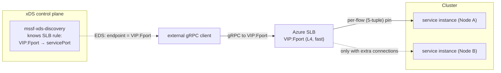
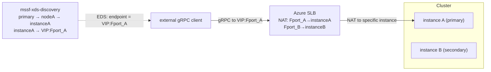

# gRPC xDS over Service Fabric on Azure Standard Load Balancer — Proposal

Status: Proposal / experiment. Nothing shipped.

Date: 2026-07-16 (last updated 2026-07-20)

Owners: mssf maintainers

Extends: [gRPC xDS over Service Fabric Naming](./GrpcXds.md)
(the base proposal — also a proposal/experiment, nothing shipped).

## Why pursue this?

The [base proposal](./GrpcXds.md) gives node-local gRPC clients a
vanilla `xds:///fabric/...` channel that resolves SF naming to the
**actual replica endpoint** and routes RPCs **directly** to it —
primary-aware, partition-aware, failover-driven. It assumes the
client runs *on a cluster node* and reaches a local
`mssf-xds-agent` over loopback/UDS, and that the replica endpoints
it hands back are reachable from the client.

On Azure, a Service Fabric cluster sits **behind an Azure Standard
Load Balancer (SLB)**. That breaks two assumptions for any client
that is not co-located on a node:

1. **Control-plane reach.** An off-node client cannot talk to a
   loopback/UDS agent. It can only reach the cluster through the
   SLB's frontend IP (VIP) / FQDN.
2. **Data-plane reach.** The base proposal's whole value is
   direct-to-replica routing. But a replica endpoint is a private
   VNet node IP. An off-VNet client can reach only the VIP, never
   an individual node — and the SLB is a flat L4 balancer with **no
   knowledge of SF partitions, replicas, or which node holds a
   primary**.

This proposal extends the xDS design so SF services fronted by an
Azure SLB are reachable with xDS semantics from clients that are
**not** node-local, and states plainly where direct-to-replica
routing is and is not achievable through an SLB.

## Background — how a SF cluster uses Azure SLB

Grounded in Azure docs
([networking patterns](https://learn.microsoft.com/en-us/azure/service-fabric/service-fabric-patterns-networking),
[managed-cluster networking](https://learn.microsoft.com/en-us/azure/service-fabric/how-to-managed-cluster-networking)).

- **Topology.** A SF cluster runs on one or more **node types**,
  each a **virtual machine scale set (VMSS)**. Each node type sits
  behind an **Azure Standard Load Balancer** with a **backend
  address pool** = the VMSS instances. The LB has a frontend IP
  (public VIP with an FQDN like
  `mycluster.<region>.cloudapp.azure.com`, or a private IP for an
  internal LB).
- **Load-balancing rules.** Each rule maps a **frontend port** to a
  **backend port** and spreads new flows across **all healthy
  backend nodes** using a 5-tuple hash. Management rules cover
  **19000** (client / TCP gateway, used by `FabricClient`) and
  **19080** (HTTP gateway / Service Fabric Explorer / the Service
  Fabric Resource Provider). Application ports (e.g. 80, 8080) are
  added as extra rules.
- **Health probes.** A TCP probe per rule (`FabricGatewayProbe`
  :19000, `FabricHttpGatewayProbe` :19080, and one per app port),
  default 5s interval / 2 probes.
- **Inbound NAT pools/rules.** Map a range of frontend ports to a
  port on a **specific VMSS instance** (e.g. 50000+ → 3389 for
  RDP). Unlike LB rules, a NAT rule targets *one* backend instance.
- **The critical property.** The SLB is **L4 and
  topology-blind**. A connection to `VIP:appPort` lands on *some*
  healthy node running that port — **not** necessarily the node
  holding the primary of the partition the caller wants. SF's own
  answer to this is the in-cluster **reverse proxy** / naming
  resolution; the SLB alone cannot route to a replica.
- **Reachability of node IPs.** Backend nodes have **private VNet
  IPs**. They are routable only from inside the VNet or across
  VNet peering / VPN / ExpressRoute. Secondary node types can
  optionally get **per-instance public IPs**
  (`enableNodePublicIP`); at the time of writing (2026-07) Azure
  managed-cluster docs restrict this to **secondary** node types
  (primary node types cannot). This has changed over time — verify
  against current managed-cluster networking docs before relying on
  it as an absolute.
- **Managed vs. classic; BYOLB.** Managed clusters auto-create a
  Standard public LB + FQDN per node type and reserve NSG priority
  ranges. **Bring-your-own-LB** (Standard SKU) is supported for
  secondary node types and requires pre-configured **backend and
  NAT pools** and explicit **outbound connectivity**.
- **Standard SLB gotchas that matter for gRPC.**
  - **Outbound rule required** — Standard SLB is "secure by
    default"; each node type needs an outbound rule (port 443 for
    cluster setup) or deployment fails.
  - **Idle timeout** — default **4 minutes** (configurable up to
    30). **Long-lived gRPC / ADS streams are silently dropped** if
    idle past the timeout unless TCP keepalive / HTTP/2 pings keep
    them warm.
  - **Session persistence** — default distribution is a 5-tuple
    hash (a given TCP flow is pinned to one backend for its life);
    optional 2-/3-tuple source-IP affinity.
  - **SFRP visibility** — 19080 must be publicly reachable for the
    portal/SFRP to query the cluster; internal-only LBs lose portal
    status.

```
        Internet / peer VNet
                |
                v
        +-----------------+          Azure Standard Load Balancer
        |  VIP / FQDN     |          (L4, topology-blind, 5-tuple)
        |  :19000 :19080  |
        |  :<app ports>   |
        +--------+--------+
                 | spreads new flows across the whole backend pool
    +------------+------------+------------------+
    v                         v                  v
+--------+               +--------+          +--------+
| Node A |               | Node B |   ...    | Node N |   (VMSS backend pool)
| privIP |               | privIP |          | privIP |
+--------+               +--------+          +--------+
   replicas of many partitioned/stateful services live here
```

## The core tension: VIP vs. per-replica addressability

xDS gives the client a set of **endpoints** and lets the client's
LB connect **directly** to the chosen one. That requires the client
to have **network reachability to each endpoint**. Behind an SLB:

- If node IPs are routable from the client (in-VNet / peered / VPN
  / ExpressRoute), xDS works exactly as in the base proposal — the
  SLB is irrelevant to the data path.
- If the client sits behind the VIP only (public internet, no VNet
  path), a single **LB rule** cannot fan a client out to arbitrary
  backend nodes or steer a flow to "the node with primary of
  partition K" — the rule spreads across the whole pool. Two ways
  out that stay **direct** (true xDS, no proxy): let any backend
  serve it and dial the VIP directly (Scenario C), or use
  **per-instance NAT** so a dedicated frontend port targets exactly
  the instance holding the primary, with the xDS server choosing
  which port to advertise (Scenario C2). When neither fits — public,
  primary-targeted, and unable to meet C2's fixed-port/NAT-budget
  constraints — routing needs an in-cluster **reverse proxy**, which
  is a different architecture (client speaks plain gRPC, proxy on
  the data path) and is specified separately in the
  [HTTP Reverse Proxy proposal](./HttpReverseProxy.md).

This proposal therefore splits on **client network position** and
**whether replica identity matters**, and covers only the **direct
(xDS) paths** A/C/C2; the proxy fallback lives in its own doc.

## Goals

1. Let an **in-VNet / peered** gRPC client use the base proposal's
   `xds:///fabric/...` channel unchanged, with the control plane
   reachable through the cluster and endpoints resolving to
   routable node IPs.
2. Define supported **direct (xDS)** paths for **off-VNet / public**
   clients that can only reach the VIP: a fast **direct-via-SLB**
   path for any-replica traffic (Scenario C) and a **primary-aware
   direct** path using per-instance NAT (Scenario C2). When neither
   fits, defer to the in-cluster reverse proxy in its own
   [proposal](./HttpReverseProxy.md).
3. Specify the **Azure SLB configuration** (rules, probes, ports,
   NAT, outbound, idle timeout) needed for the xDS control stream
   and the data path to survive an SLB.
4. Reuse the base proposal's SF→xDS translation and two-tier
   discovery **unchanged**; add only what the SLB boundary forces.

## Non-Goals

- Changing the SF→xDS mapping, URI/header strategy, or failover
  model from the base proposal. Those are inherited verbatim.
- Making the Azure SLB itself partition-aware. It stays a flat L4
  balancer; any topology awareness lives in cluster-side software.
- A public multi-tenant gateway product. This is SF-cluster-scoped.
- Managing ARM/Bicep deployment automation. We specify the
  required LB shape; templating is out of scope for v1.

## Reachability scenarios

> **Note on numbering:** there is no Scenario B below. The former
> Scenario B (in-cluster reverse proxy) moved to its own
> [reverse-proxy proposal](./HttpReverseProxy.md); the labels A, C,
> and C2 are kept stable to avoid churn in cross-references.

### Scenario A — client is in-VNet / peered / VPN / ExpressRoute

Node private IPs are routable from the client. Then:

- **Data plane:** the base proposal works **unchanged**. EDS hands
  back the replica's VNet endpoint (`10.x.y.z:port`) and the
  client connects directly — primary-aware, partition-aware,
  failover-driven. The SLB is not on the data path at all.
- **Control plane:** the client needs to reach an ADS server. Two
  options:
  - **Node-local not available (off-node, in-VNet):** point the
    client at the **two-tier control tier** (`mssf-xds-discovery`)
    via its VNet address (exposed through a VNet-internal LB rule).
    In the base design the relays re-serve only over loopback/UDS to
    on-node clients and hold no FabricClient, so **exposing a relay
    fleet to off-node clients over the network is a new capability
    this proposal would add** (relays would need a network-facing,
    TLS ADS listener) — not something the base design already
    supports. Prefer routing off-node clients to the discovery tier;
    treat a network-exposed relay/edge fleet as an explicit,
    opt-in addition. See
    [Control-plane reach through the SLB](#control-plane-reach-through-the-slb).
  - **Client on a node:** identical to the base proposal
    (loopback/UDS local agent).

Scenario A is the **recommended** target: it preserves every xDS
benefit. Most first-party callers (services in the same or a peered
VNet) fall here.

### Scenario C — direct via SLB (port-mapping translation)

When replica identity **does not matter** — a stateless service, or
any service where every eligible backend can serve the request —
there is no need for a proxy. If the cluster has an SLB rule
mapping a **frontend port to the service's backend port**
(`VIP:<frontendPort> → <servicePort>`), the client can dial the VIP
directly and the SLB forwards at L4 to a healthy backend. The data
path is the **raw SLB SDN path — no application proxy hop** — so it
is as fast as any Azure L4 traffic.

**Advertisement-time eligibility (structural, not just a role
constraint).** A flat `@slb` VIP is **topology-blind**: it hashes a
5-tuple to *some* healthy backend with no notion of which partition
that backend owns. For a **partitioned** service this is not merely a
relaxed role — it is *incorrect*: a `key=K` request can hash to a node
that hosts a **different** partition, silently violating partition
ownership. Restricting the path to `mssf-partition-role: any` (below)
does **not** fix this, because `any` still means "any replica **of the
owning partition**," which a flat VIP cannot guarantee. Therefore
Scenario C is **structurally available only** for services where
**every backend serves every key** — i.e. **`Singleton`** or
**stateless** services. The control tier **must reject** partitioned
(`Int64Range` / `Named`) targets from Scenario C advertisement
entirely (do not emit an `@slb` VIP endpoint for them, regardless of
role); such services must take a topology-aware path — Scenario A,
Scenario C2 (per-instance NAT), or the
[reverse proxy](./HttpReverseProxy.md). (Add an integration test that
hashes a key-K request to a non-owning node and asserts the
partitioned service was never advertised on the flat VIP.)

The xDS server's job here is a **translation**: instead of
advertising the service's private node endpoints (unreachable off
VNet), it advertises the **SLB frontend** as the endpoint. Concretely
the control tier, for a service that has an SLB mapping, emits a
`Cluster` whose EDS holds a single `LbEndpoint = VIP:<frontendPort>`.
The client's `tonic-xds` channel dials that; the SLB's health probe
on `<servicePort>` prunes nodes that are not running the service.

**Which VIP? (multi-node-type clusters.)** As the Background notes, a
cluster can have several node types, each its **own VMSS behind its
own LB/VIP**. The `VIP` in the translation is therefore **not
global** — it is the VIP of the node type(s) actually running the
service. In practice the service must be **pinned to one node type**
(SF placement constraints) so a single `VIP:<frontendPort>` is
well-defined; if it spans multiple node types, the control tier emits
one `LbEndpoint` **per fronting node type's VIP** (the client then
gets whichever backend any VIP hashes to — still an "any-healthy"
path). Either way the mapping the control tier holds is
**per-(service, node type)**, not a single cluster-wide VIP.

**How load actually spreads (important).** The SLB is a *per-flow*
(5-tuple) balancer, and a typical gRPC client multiplexes **all**
RPCs for a target over **one long-lived HTTP/2 connection**. That
single TCP flow is hashed to **one** backend and pinned there for
its entire life, so — for a single-channel client — **effectively no
spreading happens**: all traffic lands on one backend until the
connection is torn down. Spreading across the pool only comes from
having **multiple connections**, e.g. multiple client channels /
subchannels, `GRPC_ARG` connection settings that open more than one
transport, client-side connection cycling, or a server
`MAX_CONNECTION_AGE` that periodically forces reconnects (each new
flow re-hashes to a possibly different backend). Scenario C is
therefore an **any-healthy-backend** path — correctness does not
depend on even distribution — not a fine-grained load spreader for a
single channel.



Properties:

- **Fast:** no proxy tier, no in-cluster hop; just the SLB. This is
  the whole point versus the [reverse proxy](./HttpReverseProxy.md).
- **xDS still earns its keep:** service discovery (which services
  exist and their `VIP:port`), LB-policy / service-config push, and
  RDS selection **across** multiple SLB-fronted services. What it
  does **not** do is pick a replica *within* a service — the SLB is
  topology-blind, so `mssf-partition-key` / primary selection has no
  effect on this path. Note that **per-backend health pruning on
  this path is an SLB property** (the health probe on `<servicePort>`
  removes unhealthy nodes), **not** xDS: the only EDS endpoint is the
  VIP, so xDS would drop it only if the *entire* VIP/service is gone,
  not per replica.
- **Scope:** **`Singleton`/stateless services only** (every backend
  serves every key — see the advertisement-time eligibility rule
  above; partitioned targets are **rejected** from this path, not
  merely constrained). Within that eligible set, the path serves "any
  active replica is fine" reads — i.e. **only** the base proposal's
  `mssf-partition-role: any`. Because the VIP is topology-blind, the
  Scenario C RDS resource must **require an explicit
  `mssf-partition-role: any` match and fail closed** for absent /
  `primary` / `secondary`: it must **not** reuse the base proposal's
  absent-⇒-primary fallback, since a default-primary request served by
  the flat VIP would land on an arbitrary replica, violating the base
  proposal's write-safety guarantee. This is the per-resource
  fail-closed variant of the base
  [`mssf-partition-role` semantics](./GrpcXds.md#partition-key-semantics).
  Callers needing primary/secondary (including the absent-⇒-primary
  default) must take a topology-aware path — Scenario A (in-VNet
  direct), Scenario C2 (per-instance NAT), or the
  [reverse proxy](./HttpReverseProxy.md).
- **Dual advertisement:** the same service can be advertised two
  ways from one snapshot — node-IP endpoints for in-VNet Scenario A
  clients and a `VIP:frontendPort` endpoint for Scenario C clients.
  This **SLB-vs-direct** axis (which *endpoint set* a channel dials) is
  orthogonal to replica-role selection **only for `role=any`**; as above,
  the topology-blind VIP cannot honor `primary`/`secondary` (or the
  absent-⇒-primary default), which need a topology-aware path.
  Replica-role selection is carried per request in the
  [`mssf-partition-role` header](./GrpcXds.md#partition-key-semantics),
  **not** a resource name, whereas the SLB-vs-direct axis uses the base
  proposal's **resource-name convention** (a distinct `xds:///` target
  that the agent maps to a cluster — not a query param). Its exact
  spelling depends on that convention, still an
  [open question in the base proposal](./GrpcXds.md) (URI shape is not yet
  locked): a suffix like `.../Svc@slb` vs. `.../Svc` is one option, but `@`
  must be confirmed as a legal character in the xDS resource/target name
  `tonic-xds` accepts before adopting it — a distinct path segment (e.g.
  `.../Svc/slb`) is the safe fallback.

How the control tier learns the mapping is an
[open question](#open-questions): static config, an ARM query of
the LB's `loadBalancingRules`, or SF service-manifest labels
(SF-YARP-style `Yarp.Enable`-like opt-in).

### Scenario C2 — primary-aware direct via SLB (per-instance NAT)

Scenario C loses replica selection because an **LB rule** spreads
across the whole pool. But Azure also has **inbound NAT rules**,
which map a frontend port to a port on **one specific VMSS
instance**. That is enough to regain **primary selection with no
proxy hop**.

The idea: give each backend instance a **dedicated** NAT
frontend port that targets the service's (fixed) port on *that
instance* — `VIP:<Fport_A> → instanceA:<servicePort>`,
`VIP:<Fport_B> → instanceB:<servicePort>`, … Then the control tier
does a two-step translation:

1. FabricClient resolves the partition **primary** to its node
   endpoint (`nodeA_ip:<servicePort>` / SF node name), exactly as in
   the base proposal.
2. A **`node → VMSS-instance-ID → VIP:frontendPort`** table maps that
   node to its dedicated NAT port. The control tier advertises
   **that** `VIP:<Fport_A>` as the single EDS endpoint.

**Prerequisite — the node↔instance↔port mapping.** This is the
non-trivial part and must be called out. FabricClient identifies the
primary by **SF node name / node IP**, but inbound NAT rules target a
**VMSS instance ID**, and SF node names are **not** trivially the
same as VMSS instance IDs. The control tier therefore needs a
reliable, continuously-maintained mapping
`SF-node-name/IP → VMSS-instance-ID → NAT frontend port`. Obtaining
and keeping it correct (e.g. from IMDS/ARM instance metadata joined
to the LB's NAT rules, or an SF node property that records the
instance ID) is a hard requirement for C2 to work at all — the
"table" in step 2 does not exist for free.

**Instance IDs are only unique within a VMSS.** With multiple node
types, a bare instance ID is ambiguous — it must be qualified by node
type, since each node type is a **separate VMSS behind its own LB**.
The mapping is therefore
`SF-node → (node type / VMSS, instance ID) → that LB's VIP:frontendPort`:
resolving the primary's node also resolves **which node type's LB**
holds the NAT rule, and the advertised endpoint is **that** VIP. When
a primary moves across node types on failover, the advertised VIP
changes too, not just the frontend port.

The client dials `VIP:<Fport_A>`; the SLB NATs it to the exact
instance holding the primary. One L4 hop, no proxy, **and**
primary-correct.

**Where the Azure-specific translation lives (layering, honest).**
Steps 1–2 above require knowledge the base SF-generic tier was defined
**without**: an IMDS/ARM-sourced `node → VMSS-instance → NAT-port`
(and `→ VIP`) table, re-derived on scale events. To keep the base
proposal's "reuse the SF-generic core unchanged" claim (Goal 4) honest,
that Azure knowledge is **not** folded into the SF-generic snapshot
logic. It lives in a **decorating `mssf-slb-mapper` layer** that sits
**above** the SF-generic control tier: the base tier still produces the
ordinary SF→xDS snapshot (replica → node endpoint), and the mapper
**post-processes** it for `@slb`-advertised services, rewriting node
endpoints into `VIP:<NAT-port>` (C2) or `VIP:<frontendPort>` (C)
endpoints using the Azure table. The upward dependency on
Azure/IMDS/ARM is thus **isolated in the mapper**, not pushed into the
SF-generic translation — this is what "reuse as an unchanged core +
decorate" means, and it is the honest reading of the C/C2 data flow.

**Supported roles (C2 is topology-aware).** Unlike the flat Scenario C
VIP, the per-instance-NAT path resolves the specific replica behind
each frontend port, so it **can honor the full base-proposal role
contract** — `primary` (and the absent-⇒-primary default), `secondary`,
and `any` — exactly like Scenario A direct: the control tier advertises
the NAT port of the primary instance for `primary` (`{P}`), a secondary
instance's NAT port for `secondary` (`{S1, S2, …}`), and all instances for
`any` (`{P, S1, S2, …}`) — using the base proposal's `P`/`S1, S2, …`
replica-role notation. C2 therefore does **not** need
Scenario C's fail-closed `any`-only restriction.



**Failover reuses pre-existing NAT ports.** When the primary moves
A→B, the control tier re-resolves, sees the primary on instance B,
and pushes a new EDS endpoint `VIP:<Fport_B>`; the client reconnects
there. The key win is that **no Azure NAT rule is rewritten on
failover** — the per-instance NAT ports already exist, and only
*which pre-existing frontend port the xDS server advertises* changes.
This avoids the slow control-plane churn of "dynamically rewrite a
NAT rule on failover"; the remap happens entirely in the xDS push.

Failover **latency and client behavior are the same as the base
proposal**: re-resolve + EDS push + client reconnect, plus the
in-flight-to-old-primary window. As in the base doc, the stale
server on instance A merely returns `NotPrimary`; it does **not**
mark its own endpoint unhealthy. Only the notification-driven
control tier re-resolves and pushes the replacement endpoint (or an
unhealthy/draining EDS state), so gRPC drains to the new one without
dropping the connection abruptly. A client that observes the failure
first may trigger the separately documented forced-re-resolve fast
path. "No Azure changes" refers only to the NAT rules — the client
still experiences a normal xDS reconnect, not a zero-cost switch.

**The NAT table is not static across VMSS lifecycle events, but
scale-in and reimage differ.** The per-instance rules are only
"permanent" relative to a *fixed* instance set, and VMSS is elastic —
but the two events that move it have different effects on the NAT
mapping:

- **Scale-in (instance removed).** The instance leaves the set, and
  with inbound NAT *pools* its per-instance rule is destroyed; the
  frontend port is freed and instance IDs are **not stably reused**.
  This genuinely removes a `node → instance → NAT port` entry, so the
  table must be re-derived on scale events, not cached once.
- **Reimage (instance rebuilt in place).** Reimaging normally
  **preserves the VMSS instance identity and its generated inbound-NAT
  mapping** — only the live TCP flow is interrupted while the instance
  reboots. The NAT frontend port does **not** disappear; it points at
  the same instance again once it comes back. So the table entry
  survives; what a mid-connection client sees is a dropped flow and a
  reconnect once the instance and its replica are back.

So the `node → instance → NAT port` table is a **moving** set that
must be kept in sync with VMSS membership (re-derived on scale events;
on reimage the mapping persists but the hosted replica may relocate).
Two consequences to plan for:

- The port budget (below) tracks a **changing** instance count, not
  a one-time allocation.
- **On a mid-connection infra event, don't assume the SF primary has
  already moved.** An infrastructure-driven removal/reimage (or a node
  going down) breaks the flow *before* SF necessarily deactivates the
  node or reconverges naming. Until node deactivation and re-resolution
  complete, the control tier may still advertise the old instance's
  port — a **stale-mapping / brief-outage window** where the client
  reconnects to a port whose replica is gone or moving. Correctness
  therefore depends on the base proposal's failover ordering
  (RPC error / `NotPrimary` + forced re-resolve or control-plane EDS
  update): the client must not treat the old mapping as valid once the
  primary relocates.

**Constraints (be honest):**

- **Fixed service port.** The NAT rule's backend port is static, so
  the service must publish a **known, stable** endpoint port per
  instance. Dynamic SF ports don't work; the service manifest must
  declare a fixed endpoint (like the samples' `ServiceEndpoint1`).
- **Port budget.** One NAT frontend port per **(instance, exposed
  service)**. Scales with node count × services-exposed-this-way —
  fine for a handful of services, not for hundreds. Concretely the
  ceiling is `nodes × services-exposed` NAT ports, bounded by both the
  finite TCP frontend-port space (~65K) and Azure's **per-LB
  inbound-NAT limits** (single-instance NAT rules number in the low
  thousands per LB — verify the current figure in the Azure Load
  Balancer limits doc). So e.g. ~100 nodes × ~10 services ≈ 1000 ports
  is already near that ceiling: C2 stops scaling **well before** the
  reverse proxy would, which is the point at which to reach for it.
  Because the instance set moves (scale/reimage), the allocation must
  be **re-tracked as membership changes**, not sized once. NSG must
  open the NAT frontend-port range.
- **Multiple replicas per instance.** If one instance hosts several
  partition primaries of the same service on **distinct** ports,
  you need a NAT port per (instance, replica port) — feasible only
  if those ports are fixed and known. Shared-port hosting can't be
  disambiguated by NAT.
- **BYOLB / managed-cluster NAT pools.** The per-instance NAT pool
  must exist (BYOLB requires NAT pools anyway); on managed clusters
  confirm the NAT-pool shape is expressible.

Within those limits, **C2 dominates the reverse proxy**: same public
reachability and primary/partition awareness, but **no proxy tier
and no data-path hop**. Prefer C2 when the fixed-port and
port-budget constraints hold; fall back to the
[reverse proxy](./HttpReverseProxy.md) when they don't (many
services, dynamic ports, or large clusters).

### Choosing a scenario

All three scenarios below are **direct (xDS)** paths — no proxy on
the data path. When none fit (public, primary-targeted, and can't
meet C2's constraints), use the
[reverse proxy](./HttpReverseProxy.md) instead.

| | A: in-VNet / peered | C: direct via SLB | C2: direct via SLB (per-instance NAT) |
|---|---|---|---|
| Client network path | routes to node IPs | VIP only | VIP only |
| Data path | direct to replica | direct via SLB (L4, no proxy) | direct via SLB NAT (L4, no proxy) |
| Replica/partition-aware | yes | **no** (SLB is blind) | **yes** (NAT targets the primary's instance) |
| Requires | node-IP routability | LB rule + EDS translation | per-instance NAT + **fixed** service port |
| Port budget | — | 1 per service | 1 per (instance × service) |
| Best for | first-party, same/peered VNet | stateless / any-replica | primary-targeted, public, few services / fixed ports |
| Speed | fastest (direct) | fast (one L4 hop) | fast (one L4 hop) |

A and C/C2 can coexist for the same service (dual advertisement).
Order of preference for a **public, primary-targeted** caller: **C2**
(no hop, if fixed-port + port-budget hold) → the
[reverse proxy](./HttpReverseProxy.md) when they don't. For
**stateless/any-replica** public callers, **C** is simplest.

## Control-plane reach through the SLB

Whichever scenario, an off-node client's **ADS stream** may cross
the SLB. Design points:

- **Expose discovery on a stable LB rule.** Add a load-balancing
  rule `VIP:<xdsPort> → discoveryPort` with a TCP health probe, so
  clients can open ADS. This rule serves **every scenario's bootstrap**,
  not just Scenario A: the public **C / C2** clients that motivate this
  proposal must also reach an ADS endpoint to fetch their EDS
  translation (the SLB frontend for C, the per-instance NAT port for
  C2), and the [reverse proxy](./HttpReverseProxy.md) needs it to
  bootstrap. Which frontend each uses follows the client's network
  location:
  - **In-VNet / peered (Scenario A):** the **VNet-internal** frontend
    (private VIP).
  - **Off-VNet / public (Scenarios C and C2):** the **public** frontend
    (public VIP) — the same public boundary the C/C2 data path crosses,
    since these clients cannot reach a private VIP. Public exposure of
    the control plane **requires** client auth/authz (see
    [Security](#security)).

  **Which node type's VIP?** As with the data-plane VIPs, there is no
  single cluster VIP: the ADS rule must front a **specific node type's
  LB** — the one whose VMSS actually hosts the discovery singleton
  (pin it via placement constraints). Off-node clients bootstrap
  against **that** node type's `VIP:<xdsPort>`.

  **Pick one backend tier explicitly.**
  In the base proposal the discovery tier `mssf-xds-discovery` is a
  **stateless singleton** (`InstanceCount=1`) and the relays are
  per-node (`-1`) serving only node-local loopback/UDS clients. This
  rule should front the **discovery singleton** (a single backend —
  so there is no cross-backend "spread" and no reconnect storm across
  backends; a stream simply pins to the one instance and reconnects
  on its restart). Note the **relays do not cover a direct off-node
  client** here: relay last-known-good only helps clients that connect
  *through a relay* (node-local loopback/UDS clients). A direct client
  attached to the discovery singleton keeps the resources it has
  already **accepted** and continues serving them while it reconnects
  — so an ADS gap is a **stale-config interval** (config updates pause
  until the stream is re-established and re-synced), not an immediate
  outage. Fronting the **relay fleet** instead would require first
  giving relays a network-facing ADS listener (see Scenario A note) — a
  change this proposal would have to introduce; only then does the
  5-tuple-spread reasoning (all relays serve the same snapshot) apply.
  Do not conflate the two tiers.
- **Keepalive vs. SLB idle timeout.** ADS is a long-lived, often
  idle HTTP/2 stream. The SLB idle timeout (**4 minutes** by default)
  will silently drop it. **Require** gRPC keepalive pings (client
  `keep_alive_while_idle`, server permit-without-stream) at an
  interval below the LB idle timeout, and/or raise the rule's
  `idleTimeoutInMinutes` (**up to the 30-minute maximum**). This is
  mandatory, not optional — without it, config updates stop arriving
  and clients silently serve stale endpoints.
- **Reconnect storms.** If the discovery singleton restarts, every
  pinned client reconnects at once and re-subscribes. Bound this with
  jittered reconnect (tonic/`tower` backoff); during the gap a direct
  client keeps serving its already-accepted resources (a stale-config
  interval, not an outage), as noted above.
- **TLS.** Because the ADS stream now crosses the network (not
  loopback/UDS), it must be **TLS**, terminated at the discovery /
  relay listener. See [Security](#security).
- **Off-node bootstrap (endpoint + trust anchor).** On-node clients
  are bootstrapped by the local agent over loopback/UDS; an off-VNet
  C/C2 client has **no such channel** and must obtain, out of band, at
  least: the public ADS `VIP:<xdsPort>` / FQDN, the xDS
  bootstrap/target config, the **CA / trust anchor** to validate the
  TLS/mTLS listener, and its own **client cert / token** for the
  required authz. The straightforward answer is that the **operator
  ships a static bootstrap file plus the CA** to each off-node client
  (the same way any public gRPC client is provisioned); the cluster
  cannot self-serve this over the very channel it is trying to
  establish. This is a prerequisite for every public (C/C2) path. The
  trust anchor and client cert shipped here **must** come from the
  dedicated external-client PKI, **not** the cluster management CA (see
  [Security](#security)).

## Azure SLB configuration required

For the ports this design introduces (illustrative — exact ports
are cluster policy):

| Purpose | Frontend | Backend | Probe | Notes |
|---|---|---|---|---|
| xDS ADS — in-VNet (control) | internal `VIP:<xdsPort>` | discovery singleton port | TCP | Scenario A clients + reverse-proxy bootstrap. Raise idle timeout; require keepalive. |
| xDS ADS — public (control) | public `VIP:<xdsPort>` | discovery singleton port | TCP | Scenario C/C2 off-VNet bootstrap. **Requires** client auth/authz (mTLS or equivalent). Raise idle timeout; require keepalive. |
| Service ingress (Scenario C) | `VIP:<frontendPort>` | service port | TCP on service port | Direct-via-SLB fast path; probe prunes nodes not running the service. This mapping is exactly what the EDS translation advertises. |
| Existing mgmt | `VIP:19000/19080` | 19000/19080 | TCP | Unchanged SF management; leave as-is. |

(The reverse proxy's own gRPC ingress rule is specified in the
[reverse-proxy proposal](./HttpReverseProxy.md#azure-slb-integration).)

Also:

- **Outbound rule (443)** must exist on each node type (Standard
  SLB requirement) or deployment fails.
- **NSG rules** must open the new frontend ports inbound (managed
  clusters expose a reserved customer-usable NSG priority window —
  see the [managed-cluster networking docs](https://learn.microsoft.com/en-us/azure/service-fabric/how-to-managed-cluster-networking)
  for the exact current range, which has changed over time; classic
  clusters add to the NSG directly). Keep 19080 reachable for SFRP.
- **BYOLB** (secondary node types) must have the backend + NAT
  pools pre-configured and outbound connectivity, per Azure BYOLB
  requirements.
- **Internal LB** variant: if the whole cluster is internal-only,
  Scenario A over a private VIP is the natural fit; SFRP/portal
  visibility is lost (a known SF tradeoff, not introduced here).

## Security

The base proposal deferred mTLS because traffic was loopback/UDS,
host-trust scoped. **That no longer holds** once xDS or data-plane
traffic crosses the SLB:

- **Control plane (ADS over SLB):** require **TLS** on the
  discovery/relay listener. Because the ADS stream reveals **every
  service's endpoints**, server-only TLS is not enough — it proves the
  server's identity but lets any TLS client enumerate the topology. For
  a **public** C/C2 control-plane frontend, therefore **require client
  authentication and authorization** — **mTLS or an equivalent
  mechanism** (e.g. a validated bearer/JWT with an authz check) — so
  only authorized clients/proxies can pull topology. A **weaker,
  server-only-TLS policy is acceptable only for a clearly scoped
  private / trusted-network deployment** (VNet-internal frontend, no
  off-VNet exposure).
  - **AuthN is not authZ-of-resources.** Authenticating the caller
    does **not** authorize *which* resources it may pull. The base
    proposal's ADS
    [authorization posture](./GrpcXds.md#security) applies here: the
    default posture serves the ADS frontend **only** to fully-trusted
    first-party proxies already entitled to the whole topology; any
    **untrusted / multi-tenant** public frontend **must** add a
    **per-identity authorization layer** that scopes the served
    snapshot (per-authority / per-app) so one credential cannot
    enumerate the entire cluster. State which posture a given
    deployment adopts.
  - **Separate trust anchor for external clients.** Cluster certs
    already exist on nodes, but external ADS clients **must not** be
    provisioned a credential that chains to the **cluster management
    CA** or is valid for SF management (19000/19080) or node
    transport — that would merge a low-trust topology reader into the
    cluster-administration trust domain. Issue external ADS/proxy
    clients from a **dedicated, narrowly-scoped external-client PKI**
    whose issuing CA is **not** the cluster CA. (This is a requirement,
    not an option.)
  - **Defense-in-depth beyond authn.** Auth answers "who," not "how
    much": a public ADS frontend is still a topology-enumerating,
    handshake-consuming target. Where the client population is known,
    add an **NSG source-IP allowlist**; enable **Azure DDoS Protection**
    on the public VIP; and apply **connection/handshake rate limiting**
    on the discovery listener.
- **Data plane (Scenarios A/C/C2):** the client and replica (or the
  SLB-fronted service) negotiate TLS **end-to-end**. This works
  because the SLB is a **pure L4 passthrough** — it forwards TCP and
  does **not** terminate or inspect TLS — so the handshake and the
  session run all the way to the backend (or NAT'd instance) without
  the LB breaking it. xDS SDS can distribute certs later (base
  proposal Future work). The reverse proxy's own TLS-termination and
  authN/authZ model is covered in its
  [proposal](./HttpReverseProxy.md#security).
- **NSG posture:** expose only the xDS/service/mgmt ports needed;
  everything else stays closed. Prefer per-node-type subnets/NSGs
  (managed-cluster BYOLB pattern) so blast radius is bounded.

## Phasing

Layered on the base proposal's phases (which build the agent,
notifications, two-tier discovery, partitioning):

- **Phase S0 — validate Scenario A.** Off-node in-VNet client,
  ADS to the control tier over a VNet address, EDS resolving to
  node IPs, RPC direct to replica. Add keepalive; measure behavior
  against the SLB idle timeout. No new components.
- **Phase S1 — control plane through the SLB.** Add the
  `VIP:<xdsPort>` LB rule + probe + NSG + TLS; confirm ADS survives
  the idle timeout with keepalive and reconnects cleanly on backend
  loss.
- **Phase S1.5 — Scenario C direct-via-SLB.** For a stateless
  sample, add the `VIP:<frontendPort> → servicePort` rule + probe,
  teach the control tier the mapping, and emit the translated
  `VIP:frontendPort` EDS endpoint under an `@slb` resource name.
  Client dials the VIP directly, no proxy. Cheapest public path;
  no new runtime component.
- **Phase S1.7 — Scenario C2 primary-aware NAT.** For a
  fixed-port stateful sample (e.g. `echomain-stateful`), stand up
  the per-instance NAT pool and the `instance → VIP:frontendPort`
  table; the control tier resolves the primary and advertises that
  instance's NAT port, re-advertising on failover. Verify primary
  correctness and failover with **no Azure changes** on role move.
  No proxy tier.

The **reverse-proxy** path (for public primary-targeted callers
that C2 cannot serve) is phased separately in its
[proposal](./HttpReverseProxy.md#phasing).

**Observability for the new failure modes.** These phases introduce
silent failure modes an operator must be able to see. Watch: **ADS
stream age / last-sync time** and **keepalive-ping failures** (catches
idle-timeout drops and stale-config intervals); **EDS-advertised vs.
actual-primary mismatch** (catches the C2 stale-mapping window / wrong
NAT port); and **per-backend traffic skew** (catches Scenario C
landing all traffic on one backend). Surfacing these makes each phase
verifiable in practice rather than silently degraded.

Stop at the earliest phase that satisfies the real client
population — many clusters only ever need Scenario A.

## Open questions

- **How the control tier learns the SLB port mapping (Scenario C).**
  Three sources: (a) **static config** handed to the discovery tier
  (`servicePort → VIP:frontendPort`); (b) an **ARM/Azure query** of
  the load balancer's `loadBalancingRules` to derive the mapping
  automatically; (c) **SF service-manifest labels** where a service
  opts in (SF-YARP-style) and declares its SLB frontend port. (b)
  is most automatic but couples the control tier to Azure RM and
  needs LB read permissions; (c) keeps ownership with the service
  author. Likely support static first, then labels.
- **Per-instance public IPs as an alternative.**
  Secondary node types can get per-instance public IPs (a
  point-in-time constraint — primary node types are excluded per
  current managed-cluster docs, 2026-07; re-verify). Could EDS
  hand back those per-node public IPs so a public client *does* go
  direct-to-replica (an xDS path, no proxy)? Possible but fragile
  (public IP per node, NSG surface, cost, primary node types
  excluded) — likely a niche option, not the default.
- **Idle-timeout / keepalive defaults.** What keepalive interval
  and LB `idleTimeoutInMinutes` become the recommended baseline?
  Needs measurement on a real cluster.
- **Managed cluster automation.** Which LB rules/probes can be
  expressed through managed-cluster `loadBalancingRules` vs.
  requiring BYOLB? Affects how turnkey Scenarios A/C/C2 are.

(Reverse-proxy-specific open questions — client shape, placement —
are in its [proposal](./HttpReverseProxy.md#open-questions).)

## Future work

- **xDS SDS** to distribute replica certs, enabling
  end-to-end mTLS without out-of-band cert plumbing.
- **Private Link ingress** as a VIP alternative for partner
  clients (auxiliary subnets already support Private Link Service).
- **Global / multi-region** routing: front several clusters' VIPs
  with Azure Front Door / Traffic Manager and let xDS authorities
  select a cluster.

## References

- [Networking patterns for Azure Service Fabric](https://learn.microsoft.com/en-us/azure/service-fabric/service-fabric-patterns-networking) — internal/external LB, static IP, mgmt ports 19000/19080, Standard SLB outbound note.
- [Configure network settings for SF managed clusters](https://learn.microsoft.com/en-us/azure/service-fabric/how-to-managed-cluster-networking) — LB rules/probes, NAT pools, NSG ranges, BYOLB, per-instance public IP, IPv6.
- [Azure Load Balancer overview](https://learn.microsoft.com/en-us/azure/load-balancer/load-balancer-overview) — Standard SLB behavior, 5-tuple distribution, idle timeout.
- [gRPC xDS over Service Fabric Naming](./GrpcXds.md) — the base proposal this extends (agent, two-tier discovery, SF→xDS mapping, URI/header strategy, failover).
- [HTTP Reverse Proxy for Service Fabric](./HttpReverseProxy.md) — the in-cluster reverse-proxy fallback (generalized from this doc's former Scenario B) for public primary-targeted callers that Scenarios A/C/C2 cannot serve, covering HTTP and gRPC.
- [microsoft/service-fabric-yarp](https://github.com/microsoft/service-fabric-yarp) — prior art for an in-cluster discovery-fed data-plane proxy (HTTP; no partition-key routing).
