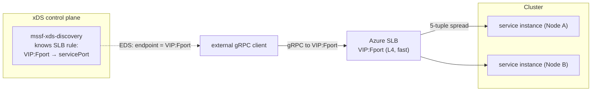
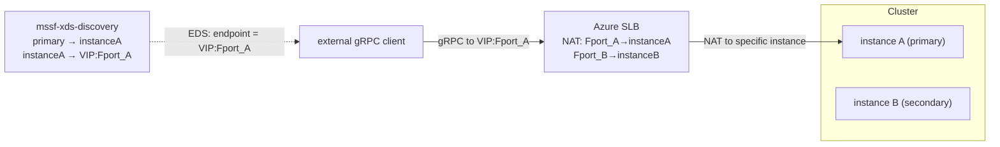

# gRPC xDS over Service Fabric on Azure Standard Load Balancer — Proposal

Status: Proposal / experiment. Nothing shipped.

Date: 2026-07-16

Owners: mssf maintainers

Extends: [gRPC xDS over Service Fabric Naming](./GrpcXds.md)
(the "base proposal", accepted).

## Why pursue this?

The [base proposal](./GrpcXds.md) gives node-local gRPC clients a
vanilla `xds:///fabric/...` channel that resolves SF naming to the
**actual replica endpoint** and routes RPCs **directly** to it —
primary-aware, partition-aware, failover-driven. It assumes the
client runs *on a cluster node* and reaches a local
`mssf-xds-agent` over loopback/UDS, and that the replica endpoints
it hands back are reachable from the client.

On Azure, a Service Fabric cluster sits **behind an Azure Standard
Load Balancer (SLB)**. That breaks two assumptions for any client
that is not co-located on a node:

1. **Control-plane reach.** An off-node client cannot talk to a
   loopback/UDS agent. It can only reach the cluster through the
   SLB's frontend IP (VIP) / FQDN.
2. **Data-plane reach.** The base proposal's whole value is
   direct-to-replica routing. But a replica endpoint is a private
   VNet node IP. An off-VNet client can reach only the VIP, never
   an individual node — and the SLB is a flat L4 balancer with **no
   knowledge of SF partitions, replicas, or which node holds a
   primary**.

This proposal extends the xDS design so SF services fronted by an
Azure SLB are reachable with xDS semantics from clients that are
**not** node-local, and states plainly where direct-to-replica
routing is and is not achievable through an SLB.

## Background — how a SF cluster uses Azure SLB

Grounded in Azure docs
([networking patterns](https://learn.microsoft.com/en-us/azure/service-fabric/service-fabric-patterns-networking),
[managed-cluster networking](https://learn.microsoft.com/en-us/azure/service-fabric/how-to-managed-cluster-networking)).

- **Topology.** A SF cluster runs on one or more **node types**,
  each a **virtual machine scale set (VMSS)**. Each node type sits
  behind an **Azure Standard Load Balancer** with a **backend
  address pool** = the VMSS instances. The LB has a frontend IP
  (public VIP with an FQDN like
  `mycluster.<region>.cloudapp.azure.com`, or a private IP for an
  internal LB).
- **Load-balancing rules.** Each rule maps a **frontend port** to a
  **backend port** and spreads new flows across **all healthy
  backend nodes** using a 5-tuple hash. Management rules cover
  **19000** (client / TCP gateway, used by `FabricClient`) and
  **19080** (HTTP gateway / Service Fabric Explorer / the Service
  Fabric Resource Provider). Application ports (e.g. 80, 8080) are
  added as extra rules.
- **Health probes.** A TCP probe per rule (`FabricGatewayProbe`
  :19000, `FabricHttpGatewayProbe` :19080, and one per app port),
  default 5s interval / 2 probes.
- **Inbound NAT pools/rules.** Map a range of frontend ports to a
  port on a **specific VMSS instance** (e.g. 50000+ → 3389 for
  RDP). Unlike LB rules, a NAT rule targets *one* backend instance.
- **The critical property.** The SLB is **L4 and
  topology-blind**. A connection to `VIP:appPort` lands on *some*
  healthy node running that port — **not** necessarily the node
  holding the primary of the partition the caller wants. SF's own
  answer to this is the in-cluster **reverse proxy** / naming
  resolution; the SLB alone cannot route to a replica.
- **Reachability of node IPs.** Backend nodes have **private VNet
  IPs**. They are routable only from inside the VNet or across
  VNet peering / VPN / ExpressRoute. Secondary node types can
  optionally get **per-instance public IPs**
  (`enableNodePublicIP`); primary node types cannot.
- **Managed vs. classic; BYOLB.** Managed clusters auto-create a
  Standard public LB + FQDN per node type and reserve NSG priority
  ranges. **Bring-your-own-LB** (Standard SKU) is supported for
  secondary node types and requires pre-configured **backend and
  NAT pools** and explicit **outbound connectivity**.
- **Standard SLB gotchas that matter for gRPC.**
  - **Outbound rule required** — Standard SLB is "secure by
    default"; each node type needs an outbound rule (port 443 for
    cluster setup) or deployment fails.
  - **Idle timeout** — default ~4–5 min. **Long-lived gRPC / ADS
    streams are silently dropped** if idle past the timeout unless
    TCP keepalive / HTTP/2 pings keep them warm.
  - **Session persistence** — default distribution is a 5-tuple
    hash (a given TCP flow is pinned to one backend for its life);
    optional 2-/3-tuple source-IP affinity.
  - **SFRP visibility** — 19080 must be publicly reachable for the
    portal/SFRP to query the cluster; internal-only LBs lose portal
    status.

```
        Internet / peer VNet
                |
                v
        +-----------------+          Azure Standard Load Balancer
        |  VIP / FQDN     |          (L4, topology-blind, 5-tuple)
        |  :19000 :19080  |
        |  :<app ports>   |
        +--------+--------+
                 | spreads new flows across the whole backend pool
    +------------+------------+------------------+
    v                         v                  v
+--------+               +--------+          +--------+
| Node A |               | Node B |   ...    | Node N |   (VMSS backend pool)
| privIP |               | privIP |          | privIP |
+--------+               +--------+          +--------+
   replicas of many partitioned/stateful services live here
```

## The core tension: VIP vs. per-replica addressability

xDS gives the client a set of **endpoints** and lets the client's
LB connect **directly** to the chosen one. That requires the client
to have **network reachability to each endpoint**. Behind an SLB:

- If node IPs are routable from the client (in-VNet / peered / VPN
  / ExpressRoute), xDS works exactly as in the base proposal — the
  SLB is irrelevant to the data path.
- If the client sits behind the VIP only (public internet, no VNet
  path), a single **LB rule** cannot fan a client out to arbitrary
  backend nodes or steer a flow to "the node with primary of
  partition K" — the rule spreads across the whole pool. Two ways
  out that stay **direct** (true xDS, no proxy): let any backend
  serve it and dial the VIP directly (Scenario C), or use
  **per-instance NAT** so a dedicated frontend port targets exactly
  the instance holding the primary, with the xDS server choosing
  which port to advertise (Scenario C2). When neither fits — public,
  primary-targeted, and unable to meet C2's fixed-port/NAT-budget
  constraints — routing needs an in-cluster **reverse proxy**, which
  is a different architecture (client speaks plain gRPC, proxy on
  the data path) and is specified separately in the
  [HTTP Reverse Proxy proposal](./HttpReverseProxy.md).

This proposal therefore splits on **client network position** and
**whether replica identity matters**, and covers only the **direct
(xDS) paths** A/C/C2; the proxy fallback lives in its own doc.

## Goals

1. Let an **in-VNet / peered** gRPC client use the base proposal's
   `xds:///fabric/...` channel unchanged, with the control plane
   reachable through the cluster and endpoints resolving to
   routable node IPs.
2. Define supported **direct (xDS)** paths for **off-VNet / public**
   clients that can only reach the VIP: a fast **direct-via-SLB**
   path for any-replica traffic (Scenario C) and a **primary-aware
   direct** path using per-instance NAT (Scenario C2). When neither
   fits, defer to the in-cluster reverse proxy in its own
   [proposal](./HttpReverseProxy.md).
3. Specify the **Azure SLB configuration** (rules, probes, ports,
   NAT, outbound, idle timeout) needed for the xDS control stream
   and the data path to survive an SLB.
4. Reuse the base proposal's SF→xDS translation and two-tier
   discovery **unchanged**; add only what the SLB boundary forces.

## Non-Goals

- Changing the SF→xDS mapping, URI/header strategy, or failover
  model from the base proposal. Those are inherited verbatim.
- Making the Azure SLB itself partition-aware. It stays a flat L4
  balancer; any topology awareness lives in cluster-side software.
- A public multi-tenant gateway product. This is SF-cluster-scoped.
- Managing ARM/Bicep deployment automation. We specify the
  required LB shape; templating is out of scope for v1.

## Reachability scenarios

### Scenario A — client is in-VNet / peered / VPN / ExpressRoute

Node private IPs are routable from the client. Then:

- **Data plane:** the base proposal works **unchanged**. EDS hands
  back the replica's VNet endpoint (`10.x.y.z:port`) and the
  client connects directly — primary-aware, partition-aware,
  failover-driven. The SLB is not on the data path at all.
- **Control plane:** the client needs to reach an ADS server. Two
  options:
  - **Node-local not available (off-node, in-VNet):** point the
    client at the **two-tier control tier** (`mssf-xds-discovery`)
    via its VNet address, or at a small set of relays exposed on a
    VNet-internal LB rule. See
    [Control-plane reach through the SLB](#control-plane-reach-through-the-slb).
  - **Client on a node:** identical to the base proposal
    (loopback/UDS local agent).

Scenario A is the **recommended** target: it preserves every xDS
benefit. Most first-party callers (services in the same or a peered
VNet) fall here.

### Scenario C — direct via SLB (port-mapping translation)

When replica identity **does not matter** — a stateless service, or
any service where every eligible backend can serve the request —
there is no need for a proxy. If the cluster has an SLB rule
mapping a **frontend port to the service's backend port**
(`VIP:<frontendPort> → <servicePort>`), the client can dial the VIP
directly and the SLB forwards at L4 to a healthy backend. The data
path is the **raw SLB SDN path — no application proxy hop** — so it
is as fast as any Azure L4 traffic.

The xDS server's job here is a **translation**: instead of
advertising the service's private node endpoints (unreachable off
VNet), it advertises the **SLB frontend** as the endpoint. Concretely
the control tier, for a service that has an SLB mapping, emits a
`Cluster` whose EDS holds a single `LbEndpoint = VIP:<frontendPort>`.
The client's `tonic-xds` channel dials that; the SLB spreads across
the backend pool; the SLB's health probe on `<servicePort>` prunes
nodes that are not running the service.



Properties:

- **Fast:** no proxy tier, no in-cluster hop; just the SLB. This is
  the whole point versus the [reverse proxy](./HttpReverseProxy.md).
- **xDS still earns its keep:** service discovery (which services
  exist and their `VIP:port`), health-driven removal, LB-policy /
  service-config push, and RDS selection **across** multiple
  SLB-fronted services. What it does **not** do is pick a replica
  *within* a service — the SLB is topology-blind, so
  `mssf-partition-key` / primary selection has no effect on this
  path.
- **Scope:** stateless services, or "any active replica is fine"
  reads. **Not** for partition/primary-targeted calls — those need
  Scenario A (in-VNet direct), Scenario C2 (per-instance NAT), or
  the [reverse proxy](./HttpReverseProxy.md).
- **Dual advertisement:** the same service can be advertised two
  ways from one snapshot — node-IP endpoints for in-VNet Scenario A
  clients and a `VIP:frontendPort` endpoint for Scenario C clients.
  The client selects via the base proposal's **resource-name
  convention** (a distinct `xds:///` target, e.g. `.../Svc` vs.
  `.../Svc@slb`), so no query params are needed.

How the control tier learns the mapping is an
[open question](#open-questions): static config, an ARM query of
the LB's `loadBalancingRules`, or SF service-manifest labels
(SF-YARP-style `Yarp.Enable`-like opt-in).

### Scenario C2 — primary-aware direct via SLB (per-instance NAT)

Scenario C loses replica selection because an **LB rule** spreads
across the whole pool. But Azure also has **inbound NAT rules**,
which map a frontend port to a port on **one specific VMSS
instance**. That is enough to regain **primary selection with no
proxy hop**.

The idea: give each backend instance a **dedicated, static** NAT
frontend port that targets the service's (fixed) port on *that
instance* — `VIP:<Fport_A> → instanceA:<servicePort>`,
`VIP:<Fport_B> → instanceB:<servicePort>`, … set up **once**. Then
the control tier does a two-step translation:

1. FabricClient resolves the partition **primary** to its node
   endpoint (`nodeA_ip:<servicePort>`), exactly as in the base
   proposal.
2. A static **`instance → VIP:frontendPort`** table maps that
   instance to its dedicated NAT port. The control tier advertises
   **that** `VIP:<Fport_A>` as the single EDS endpoint.

The client dials `VIP:<Fport_A>`; the SLB NATs it to the exact
instance holding the primary. One L4 hop, no proxy, **and**
primary-correct.



**Failover is cheap and Azure-static.** When the primary moves
A→B, the control tier re-resolves, sees the primary on instance B,
and pushes a new EDS endpoint `VIP:<Fport_B>`; the client reconnects
there. **Nothing in Azure changes** — the NAT rules are permanent,
one per instance; only *which pre-existing frontend port the xDS
server advertises* changes. This is the crucial difference from
"dynamically rewrite a NAT rule on failover," which would be slow
control-plane churn; here the remap happens entirely in the xDS
push.

**Constraints (be honest):**

- **Fixed service port.** The NAT rule's backend port is static, so
  the service must publish a **known, stable** endpoint port per
  instance. Dynamic SF ports don't work; the service manifest must
  declare a fixed endpoint (like the samples' `ServiceEndpoint1`).
- **Port budget.** One NAT frontend port per **(instance, exposed
  service)**. Scales with node count × services-exposed-this-way —
  fine for a handful of services, not for hundreds. NSG must open
  the NAT frontend-port range.
- **Multiple replicas per instance.** If one instance hosts several
  partition primaries of the same service on **distinct** ports,
  you need a NAT port per (instance, replica port) — feasible only
  if those ports are fixed and known. Shared-port hosting can't be
  disambiguated by NAT.
- **BYOLB / managed-cluster NAT pools.** The per-instance NAT pool
  must exist (BYOLB requires NAT pools anyway); on managed clusters
  confirm the NAT-pool shape is expressible.

Within those limits, **C2 dominates the reverse proxy**: same public
reachability and primary/partition awareness, but **no proxy tier
and no data-path hop**. Prefer C2 when the fixed-port and
port-budget constraints hold; fall back to the
[reverse proxy](./HttpReverseProxy.md) when they don't (many
services, dynamic ports, or large clusters).

### Choosing a scenario

All three scenarios below are **direct (xDS)** paths — no proxy on
the data path. When none fit (public, primary-targeted, and can't
meet C2's constraints), use the
[reverse proxy](./HttpReverseProxy.md) instead.

| | A: in-VNet / peered | C: direct via SLB | C2: direct via SLB (per-instance NAT) |
|---|---|---|---|
| Client network path | routes to node IPs | VIP only | VIP only |
| Data path | direct to replica | direct via SLB (L4, no proxy) | direct via SLB NAT (L4, no proxy) |
| Replica/partition-aware | yes | **no** (SLB is blind) | **yes** (NAT targets the primary's instance) |
| Requires | node-IP routability | LB rule + EDS translation | per-instance NAT + **fixed** service port |
| Port budget | — | 1 per service | 1 per (instance × service) |
| Best for | first-party, same/peered VNet | stateless / any-replica | primary-targeted, public, few services / fixed ports |
| Speed | fastest (direct) | fast (one L4 hop) | fast (one L4 hop) |

A and C/C2 can coexist for the same service (dual advertisement).
Order of preference for a **public, primary-targeted** caller: **C2**
(no hop, if fixed-port + port-budget hold) → the
[reverse proxy](./HttpReverseProxy.md) when they don't. For
**stateless/any-replica** public callers, **C** is simplest.

## Control-plane reach through the SLB

Whichever scenario, an off-node client's **ADS stream** may cross
the SLB. Design points:

- **Expose discovery on a stable LB rule.** Add a load-balancing
  rule `VIP:<xdsPort> → discoveryPort` with a TCP health probe, so
  clients (Scenario A) or the [reverse proxy](./HttpReverseProxy.md)
  (bootstrapping) can open ADS.
  All relays/discovery instances serve the same snapshot, so the
  5-tuple spread is safe — a stream pins to one backend for its
  life; on backend loss the client reconnects and re-subscribes
  (standard xDS).
- **Keepalive vs. SLB idle timeout.** ADS is a long-lived, often
  idle HTTP/2 stream. The SLB idle timeout (~4–5 min) will silently
  drop it. **Require** gRPC keepalive pings (client
  `keep_alive_while_idle`, server permit-without-stream) at an
  interval below the LB idle timeout, and/or raise the rule's
  `idleTimeoutInMinutes`. This is mandatory, not optional — without
  it, config updates stop arriving and clients silently serve stale
  endpoints.
- **Reconnect storms.** If a discovery backend fails, every pinned
  client reconnects at once and re-subscribes. Bound this with
  jittered reconnect (tonic/`tower` backoff) and rely on relays
  holding last-known-good so a reconnect gap is not an outage.
- **TLS.** Because the ADS stream now crosses the network (not
  loopback/UDS), it must be **TLS**, terminated at the discovery /
  relay listener. See [Security](#security).

## Azure SLB configuration required

For the ports this design introduces (illustrative — exact ports
are cluster policy):

| Purpose | Frontend | Backend | Probe | Notes |
|---|---|---|---|---|
| xDS ADS (control) | `VIP:<xdsPort>` | discovery/relay port | TCP | Scenario A clients + reverse-proxy bootstrap. Raise idle timeout; require keepalive. |
| Service ingress (Scenario C) | `VIP:<frontendPort>` | service port | TCP on service port | Direct-via-SLB fast path; probe prunes nodes not running the service. This mapping is exactly what the EDS translation advertises. |
| Existing mgmt | `VIP:19000/19080` | 19000/19080 | TCP | Unchanged SF management; leave as-is. |

(The reverse proxy's own gRPC ingress rule is specified in the
[reverse-proxy proposal](./HttpReverseProxy.md#azure-slb-integration).)

Also:

- **Outbound rule (443)** must exist on each node type (Standard
  SLB requirement) or deployment fails.
- **NSG rules** must open the new frontend ports inbound
  (managed-cluster custom NSG range 1000–3000; classic clusters add
  to the NSG directly). Keep 19080 reachable for SFRP.
- **BYOLB** (secondary node types) must have the backend + NAT
  pools pre-configured and outbound connectivity, per Azure BYOLB
  requirements.
- **Internal LB** variant: if the whole cluster is internal-only,
  Scenario A over a private VIP is the natural fit; SFRP/portal
  visibility is lost (a known SF tradeoff, not introduced here).

## Security

The base proposal deferred mTLS because traffic was loopback/UDS,
host-trust scoped. **That no longer holds** once xDS or data-plane
traffic crosses the SLB:

- **Control plane (ADS over SLB):** require **TLS** on the
  discovery/relay listener; strongly prefer **mTLS** so only
  authorized clients/proxies can pull the topology (it reveals
  every service's endpoints). Cluster certs already exist on nodes;
  reuse them or issue a dedicated xDS cert.
- **Data plane (Scenarios A/C/C2):** the client and replica (or the
  SLB-fronted service) negotiate TLS end-to-end; xDS SDS can
  distribute certs later (base proposal Future work). The reverse
  proxy's own TLS-termination and authN/authZ model is covered in
  its [proposal](./HttpReverseProxy.md#security).
- **NSG posture:** expose only the xDS/service/mgmt ports needed;
  everything else stays closed. Prefer per-node-type subnets/NSGs
  (managed-cluster BYOLB pattern) so blast radius is bounded.

## Phasing

Layered on the base proposal's phases (which build the agent,
notifications, two-tier discovery, partitioning):

- **Phase S0 — validate Scenario A.** Off-node in-VNet client,
  ADS to the control tier over a VNet address, EDS resolving to
  node IPs, RPC direct to replica. Add keepalive; measure behavior
  against the SLB idle timeout. No new components.
- **Phase S1 — control plane through the SLB.** Add the
  `VIP:<xdsPort>` LB rule + probe + NSG + TLS; confirm ADS survives
  the idle timeout with keepalive and reconnects cleanly on backend
  loss.
- **Phase S1.5 — Scenario C direct-via-SLB.** For a stateless
  sample, add the `VIP:<frontendPort> → servicePort` rule + probe,
  teach the control tier the mapping, and emit the translated
  `VIP:frontendPort` EDS endpoint under an `@slb` resource name.
  Client dials the VIP directly, no proxy. Cheapest public path;
  no new runtime component.
- **Phase S1.7 — Scenario C2 primary-aware NAT.** For a
  fixed-port stateful sample (e.g. `echomain-stateful`), stand up
  the per-instance NAT pool and the `instance → VIP:frontendPort`
  table; the control tier resolves the primary and advertises that
  instance's NAT port, re-advertising on failover. Verify primary
  correctness and failover with **no Azure changes** on role move.
  No proxy tier.

The **reverse-proxy** path (for public primary-targeted callers
that C2 cannot serve) is phased separately in its
[proposal](./HttpReverseProxy.md#phasing).

Stop at the earliest phase that satisfies the real client
population — many clusters only ever need Scenario A.

## Open questions

- **How the control tier learns the SLB port mapping (Scenario C).**
  Three sources: (a) **static config** handed to the discovery tier
  (`servicePort → VIP:frontendPort`); (b) an **ARM/Azure query** of
  the load balancer's `loadBalancingRules` to derive the mapping
  automatically; (c) **SF service-manifest labels** where a service
  opts in (SF-YARP-style) and declares its SLB frontend port. (b)
  is most automatic but couples the control tier to Azure RM and
  needs LB read permissions; (c) keeps ownership with the service
  author. Likely support static first, then labels.
- **Per-instance public IPs as an alternative.**
  Secondary node types can get per-instance public IPs. Could EDS
  hand back those per-node public IPs so a public client *does* go
  direct-to-replica (an xDS path, no proxy)? Possible but fragile
  (public IP per node, NSG surface, cost, primary node types
  excluded) — likely a niche option, not the default.
- **Idle-timeout / keepalive defaults.** What keepalive interval
  and LB `idleTimeoutInMinutes` become the recommended baseline?
  Needs measurement on a real cluster.
- **Managed cluster automation.** Which LB rules/probes can be
  expressed through managed-cluster `loadBalancingRules` vs.
  requiring BYOLB? Affects how turnkey Scenarios A/C/C2 are.

(Reverse-proxy-specific open questions — client shape, placement —
are in its [proposal](./HttpReverseProxy.md#open-questions).)

## Future work

- **xDS SDS** to distribute replica certs, enabling
  end-to-end mTLS without out-of-band cert plumbing.
- **Private Link ingress** as a VIP alternative for partner
  clients (auxiliary subnets already support Private Link Service).
- **Global / multi-region** routing: front several clusters' VIPs
  with Azure Front Door / Traffic Manager and let xDS authorities
  select a cluster.

## References

- [Networking patterns for Azure Service Fabric](https://learn.microsoft.com/en-us/azure/service-fabric/service-fabric-patterns-networking) — internal/external LB, static IP, mgmt ports 19000/19080, Standard SLB outbound note.
- [Configure network settings for SF managed clusters](https://learn.microsoft.com/en-us/azure/service-fabric/how-to-managed-cluster-networking) — LB rules/probes, NAT pools, NSG ranges, BYOLB, per-instance public IP, IPv6.
- [Azure Load Balancer overview](https://learn.microsoft.com/en-us/azure/load-balancer/load-balancer-overview) — Standard SLB behavior, 5-tuple distribution, idle timeout.
- [gRPC xDS over Service Fabric Naming](./GrpcXds.md) — the base proposal this extends (agent, two-tier discovery, SF→xDS mapping, URI/header strategy, failover).
- [HTTP Reverse Proxy for Service Fabric](./HttpReverseProxy.md) — the in-cluster reverse-proxy fallback (generalized from this doc's former Scenario B) for public primary-targeted callers that Scenarios A/C/C2 cannot serve, covering HTTP and gRPC.
- [microsoft/service-fabric-yarp](https://github.com/microsoft/service-fabric-yarp) — prior art for an in-cluster discovery-fed data-plane proxy (HTTP; no partition-key routing).
