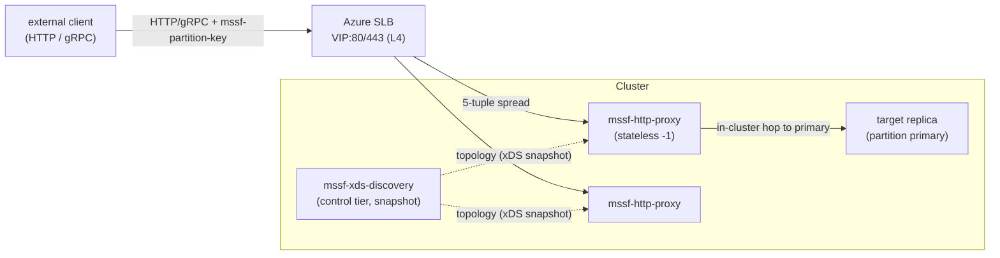

# HTTP Reverse Proxy for Service Fabric — Proposal

Status: Proposal / experiment. Nothing shipped.

Date: 2026-07-17

Owners: mssf maintainers

Relates to:
[gRPC xDS over Service Fabric Naming](./GrpcXds.md) (the "base xDS
proposal", accepted) and
[gRPC xDS over Service Fabric on Azure SLB](./GrpcXdsSlb.md) (the
"SLB proposal"). This doc **generalizes the SLB proposal's former
Scenario B** — originally a gRPC-only gateway — into a generic
**SF-naming-aware HTTP reverse proxy** that covers HTTP/1.1,
HTTP/2, and gRPC (which is HTTP/2). It is architecturally a
**reverse proxy**, not an xDS design — see
[Is this xDS?](#is-this-xds).

## Why pursue this?

The xDS scenarios cover most callers that can reach service
endpoints directly:

- **In-VNet / peered** clients get direct-to-replica xDS
  (base proposal + SLB proposal Scenario A).
- **Public, any-replica** clients dial the VIP directly
  (SLB proposal Scenario C).
- **Public, primary-targeted** clients dial per-instance NAT ports
  directly (SLB proposal Scenario C2) **when** the service has a
  fixed port and the NAT budget is acceptable.

Two gaps remain, and both point at a reverse proxy:

1. **Public / VIP-only, primary-targeted, can't meet C2.** A client
   that can reach only the VIP, needs partition/primary-aware
   routing, and cannot satisfy Scenario C2's fixed-port +
   per-instance-NAT constraints (many services, dynamic ports,
   large cluster). A single L4 VIP cannot steer it to "the node
   holding partition K's primary" — something inside the cluster
   must decide.
2. **Plain HTTP services, not just gRPC.** SF hosts REST/HTTP
   services too. A single L7 entry point that resolves SF naming,
   selects the partition/primary, and proxies **any** HTTP verb —
   plus gRPC as a first-class HTTP/2 case — is more broadly useful
   than a gRPC-only gateway and matches what SF's built-in reverse
   proxy and SF-YARP already do for HTTP (but without their
   limitations; see [SF-YARP](#can-sf-yarp-be-used-directly)).

This proposal defines `mssf-http-proxy`: an SF-naming-aware,
partition/primary-aware HTTP reverse proxy that terminates external
HTTP/HTTP2/gRPC behind the SLB and forwards each request to the
correct replica.

## Is this xDS?

**No — and that is why it lives in its own doc.** The defining
property of xDS is that the *client's own* data plane receives the
endpoint set and connects **directly** to the chosen backend; the
control plane is never on the data path. That holds for SLB
Scenarios A / C / C2. It does **not** hold here:

| | xDS scenarios (A/C/C2) | This proposal (proxy) |
|---|---|---|
| Client runs xDS? | yes | **no** — plain HTTP/gRPC to the VIP |
| Who connects to the replica? | the client, directly | **the proxy**, then re-originates |
| Control/proxy on the data path? | no | **yes** — the proxy is the data path |
| Pattern | xDS | **L7 reverse proxy** |

The client here has no endpoint set, no LB policy, no xDS resolver
— it opens a normal HTTP or gRPC connection to a fixed VIP and (for
partitioned services) sets the `mssf-partition-key` header. All
routing happens **server-side** in the proxy. xDS appears only
*inside* the proxy, as one way it ingests topology (below) — and
even that is optional. This is the textbook definition of a reverse
proxy, the same slot SF's built-in reverse proxy and
[SF-YARP](https://github.com/microsoft/service-fabric-yarp) occupy.

Treat this as the **escape hatch / general ingress** for callers
the direct xDS paths cannot serve — not as "xDS for public
clients".

## Protocol scope

The proxy is **transport-generic at the routing layer** (it routes
on host / path / headers) but must be **protocol-correct at the
transport layer**. Concretely:

- **HTTP/1.1** — standard request/response proxying.
- **HTTP/2 (h2, h2c)** — required, including for gRPC.
- **gRPC** — gRPC *is* HTTP/2 with `content-type: application/grpc`,
  **trailers** (`grpc-status` / `grpc-message` arrive in HTTP/2
  *trailing* headers), and **long-lived streams**. To carry gRPC
  correctly the proxy **must**:
  - speak **HTTP/2 end-to-end**, including to the backend (never
    downgrade to HTTP/1.1 upstream);
  - **forward trailers** (drop them and every RPC looks like it
    returned no status);
  - **stream** without buffering whole request/response bodies.

  These are hard requirements, not niceties: a stock HTTP/1.1 proxy
  (or one that terminates to HTTP/1.1, strips trailers, or buffers
  bodies) **silently breaks gRPC**. This is why nginx needs
  `grpc_pass` rather than plain `proxy_pass`. Building on
  **tonic / hyper / tower** gives HTTP/2 + trailers + streaming
  natively, so gRPC is covered without special-casing routing.

**Out of scope for v1** (possible future work): **gRPC-Web**
translation (browser clients over HTTP/1.1), **HTTP/JSON ↔ gRPC
transcoding** (needs proto descriptors), and **WebSocket**
upgrades. None are required to proxy HTTP or native gRPC.

## Goals

1. Give **public / VIP-only** clients partition/primary-aware
   access to SF services — HTTP and gRPC alike — when SLB
   Scenarios A/C/C2 do not apply.
2. Reuse the base proposal's **partition-key semantics** and
   **failover model** so routing behavior matches the in-cluster
   xDS path; only the *place* the decision is made differs.
3. Keep the external client trivial: normal HTTP/gRPC to the VIP,
   plus the `mssf-partition-key` header for partitioned services.
   No SF-specific client code.
4. Improve on SF's built-in reverse proxy and SF-YARP: native
   HTTP/2 + trailers for gRPC, **key-based** partition selection,
   and Linux support.

## Non-Goals

- A general-purpose API gateway (rate limiting, quotas, developer
  portal, etc.). This is an SF-naming-aware L7 data plane.
- Replacing the xDS scenarios. Direct-to-replica (A/C/C2) is
  preferred whenever the client can reach endpoints; the proxy is
  the fallback and adds a hop.
- Protocol translation (gRPC-Web, JSON transcoding) in v1.
- Reimplementing SF naming or the SF→xDS mapping — inherited from
  the base proposal.

## Design

### The proxy

`mssf-http-proxy` is a stateless `-1` service deployed on a node
type exposed by the SLB. It:

1. **Ingests topology** (see [Config ingest](#config-ingest)) —
   which services exist, their partitions, and each partition's
   current primary/secondary endpoints.
2. **Terminates external HTTP/HTTP2/gRPC** on stable ports
   (`VIP:80` / `VIP:443`). The SLB spreads external connections
   across proxy instances by 5-tuple; any instance can serve any
   request because all share the same topology.
3. **Selects the service** from the request (Host header and/or URL
   path prefix — e.g. `/<App>/<Service>/...`, mirroring SF's
   built-in reverse proxy addressing — or an explicit mapping).
4. **Selects the partition** by reading `mssf-partition-key`,
   using the base proposal's
   [partition-key semantics](./GrpcXds.md#partition-key-semantics)
   (decimal `i64` for Int64Range, exact name for Named). Singleton
   services skip this step.
5. **Selects the replica** — the partition's **primary** by default,
   or a secondary for read routes — and forwards the request,
   preserving method, headers, body, and (for gRPC) trailers and
   streaming.
6. **Follows failover** — when the primary moves, the topology
   update repoints the proxy; in-flight retries land on the new
   primary.

**Tradeoff, stated honestly:** this is **not** direct-to-replica.
It adds one in-cluster hop and a proxy tier, and gives up the "no
data-path component" property the base proposal is proud of. It is
the price of serving a client that can reach only a single L4 VIP,
and of offering one generic HTTP entry point.

### Config ingest

The proxy needs SF topology; two sources, an implementation detail
that does not change its reverse-proxy nature:

- **Reuse the xDS control-tier snapshot (preferred).** If the
  [two-tier discovery](./GrpcXds.md#two-tier-discovery-sf-yarp-inspired)
  control tier is deployed, the proxy subscribes to the same
  LDS/RDS/CDS/EDS snapshot every other consumer uses — one source
  of truth, one config model, no extra SF-naming load.
- **Read SF naming directly.** The proxy owns a `FabricClient` and
  resolves/subscribes itself (what SF-YARP's
  `FabricDiscovery.Service` does). Simpler to deploy standalone but
  duplicates the naming subscription and the SF→xDS logic.

Prefer reuse when the control tier already exists; standalone
direct-naming is a valid MVP.

### Routing model

- **Service:** Host header and/or path prefix, or explicit config.
- **Partition:** `mssf-partition-key` header — a normal HTTP header
  for HTTP callers, request metadata for gRPC callers — matched to
  the owning partition per the base proposal's semantics. Malformed
  or missing keys fail the same way (hard error, never a silent
  fallback to an arbitrary partition).
- **Replica:** primary by default; secondary for explicitly marked
  read routes.

## Can SF-YARP be used directly?

Now that this is a generic HTTP proxy, [SF-YARP](https://github.com/microsoft/service-fabric-yarp)
is the closest prior art — it is exactly an SF-naming-fed YARP
(HTTP) reverse proxy. So the question is sharper than before.

**What SF-YARP already does:** a YARP-based L7 HTTP proxy with
HTTP/2 (so it can proxy gRPC), SF discovery + endpoint resolution,
and `StatefulReplicaSelectionMode` = `PrimaryOnly` / `All` /
`SecondaryOnly`. For **HTTP or gRPC** to **stateless, singleton, or
primary-only** services, SF-YARP may already be sufficient with no
new code.

**Where SF-YARP falls short:**

- **No key-based partition selection.** SF-YARP "does not handle
  the partitioning key" — the caller must pass the **partition GUID
  as a query parameter**. This proposal routes on
  `mssf-partition-key` (i64 / name matching the SF scheme), so the
  caller supplies the natural key, not a resolved GUID. Decisive
  functional gap.
- **Windows-only.** "YarpProxy app is only supported on Windows."
  mssf targets Linux and Windows.
- **Separate stack / config model.** SF-YARP is .NET/YARP with its
  own `FabricDiscovery.Service` and service-manifest `Yarp.*`
  labels. A tonic proxy reusing the base proposal's xDS snapshot
  keeps one source of truth and one runtime across in-cluster and
  proxy paths.
- **Maturity.** The SF-YARP repo is effectively dormant (~2022,
  .NET 5/6-era).

**Recommendation.** Use SF-YARP as a valid **stopgap** when *all*
of these hold: Windows cluster, callers that can pass an explicit
partition GUID (or stateless/primary-only services), and no desire
to unify on the xDS snapshot. Build `mssf-http-proxy` when
**key-based** partition routing, **Linux**, or **config/stack
unification** matters. Extending SF-YARP with a key→partition
plugin is possible but stays Windows/.NET and closes neither gap.

## Azure SLB integration

The proxy is normally the **public ingress**, so it sits behind the
SLB. Required LB shape (illustrative ports):

| Purpose | Frontend | Backend | Probe | Notes |
|---|---|---|---|---|
| HTTP ingress | `VIP:80` | proxy HTTP port | TCP/HTTP | plaintext / h2c |
| HTTPS ingress | `VIP:443` | proxy HTTPS port | TCP/HTTPS | TLS termination at the proxy |

Plus the Standard-SLB essentials from the SLB proposal apply:
outbound rule (443), NSG opening the ingress ports inbound, and —
because HTTP/2 and gRPC streams are long-lived — **keepalive tuned
below the SLB idle timeout** (~4–5 min) so streams are not silently
dropped. See
[SLB proposal — Azure SLB configuration](./GrpcXdsSlb.md#azure-slb-configuration-required).

## Security

A public VIP is internet-facing, so the proxy is the security
boundary:

- **TLS termination.** The proxy terminates client TLS at the VIP
  and re-originates to the replica with mTLS inside the cluster
  (cluster certs). For gRPC, upstream must remain HTTP/2.
- **AuthN/AuthZ.** The proxy is the natural place to enforce client
  identity (mTLS client certs, tokens/JWT) and per-service
  authorization before it will proxy.
- **NSG posture.** Expose only the ingress ports (and control-plane
  ports if the proxy ingests xDS over the network); everything else
  closed. Prefer per-node-type subnets/NSGs so blast radius is
  bounded.

## Phasing

- **Phase P1 — MVP.** `mssf-http-proxy` ingesting the control-tier
  snapshot (or direct SF naming), terminating external HTTP at
  `VIP:80/443`, selecting service + primary; **HTTP/1.1 and plain
  HTTP/2** first, stateless / singleton services.
- **Phase P2 — gRPC + partitioning.** End-to-end HTTP/2 with
  **trailer forwarding and streaming** (native gRPC), plus
  `mssf-partition-key` selection (RDS `Range`/`Exact`) and
  primary+secondary read routes.
- **Phase P3 — hardening.** mTLS end-to-end, authN/authZ, outlier
  ejection, metrics, retry/hedging over failover windows.

Only build this when the client population actually includes
VIP-only callers (or plain-HTTP services) the direct xDS paths
cannot serve.

## Open questions

- **Service addressing convention.** Host-based
  (`svc.app.example.com`), path-based (`/<App>/<Service>/...` like
  SF's built-in reverse proxy), or configurable? Path-based matches
  existing SF muscle memory; host-based is cleaner for per-service
  TLS/authz.
- **Config-ingest choice.** Reuse control-tier snapshot vs. direct
  SF naming — pick per deployment, or support both behind one
  interface?
- **Placement.** Dedicated node type behind its own LB, or
  co-resident with the discovery control tier? Isolation vs.
  footprint.
- **gRPC value-adds.** Should the proxy read `grpc-status` trailers
  for status-aware retry/hedging during failover, or stay
  status-agnostic? Reading trailers is more useful but couples the
  proxy to gRPC semantics.
- **Per-instance public IPs as an alternative.** Secondary node
  types can get per-instance public IPs; a public client could then
  go direct-to-replica (an xDS path) and skip the proxy. Fragile
  (public IP per node, NSG surface, cost, primary node types
  excluded) — niche, but it moves such callers back onto the xDS
  scenarios.

## Future work

- **gRPC-Web** translation for browser clients.
- **HTTP/JSON ↔ gRPC transcoding** (proto-descriptor driven).
- **ORCA / LRS** load-aware balancing across replicas.
- **Private Link ingress** as a VIP alternative for partner
  clients.

## References

- [gRPC xDS over Service Fabric Naming](./GrpcXds.md) — base proposal: SF→xDS mapping, partition-key semantics, two-tier discovery, failover.
- [gRPC xDS over Service Fabric on Azure SLB](./GrpcXdsSlb.md) — the xDS scenarios (A/C/C2) this proposal is the fallback for; Azure SLB configuration details.
- [microsoft/service-fabric-yarp](https://github.com/microsoft/service-fabric-yarp) — prior art: an SF-naming-fed HTTP reverse proxy (no partition-key routing; Windows-only).
- [Networking patterns for Azure Service Fabric](https://learn.microsoft.com/en-us/azure/service-fabric/service-fabric-patterns-networking) — SLB, mgmt ports, outbound requirement.
